# TACZ 默认枪包 (tacz_default_gun)

## 🔫 枪械列表

| 图片 | NBT GunId (GunId标签) | 枪械名称 | 枪械类型 | 支持的配件槽位 |
|---|---|---|---|---|
|  | `tacz:aa12` | AA12 霰弹枪 | 霰弹枪 | 瞄具, 扩容弹匣, 握把, 枪口 |
|  | `tacz:ai_awp` | 精密国际 AWM 狙击步枪 | 狙击枪 | 扩容弹匣, 瞄具, 枪口 |
|  | `tacz:ak47` | AKM 突击步枪 | 步枪 | 瞄具, 枪托, 枪口, 扩容弹匣 |
|  | `tacz:aug` | AUG 突击步枪 | 步枪 | 枪口, 扩容弹匣, 激光 |
|  | `tacz:b93r` | B93R 冲锋手枪 | 手枪 | 枪口, 瞄具, 扩容弹匣 |
|  | `tacz:cz75` | CZ 75 自动手枪 | 手枪 | 瞄具, 扩容弹匣 |
|  | `tacz:db_long` | DB-4 乌萨斯 | 霰弹枪 | 扩容弹匣 |
|  | `tacz:db_short` | DB-2 杜林人 | 霰弹枪 | 枪托, 扩容弹匣 |
|  | `tacz:deagle` | .50 沙漠之鹰 | 手枪 | 瞄具, 枪口, 扩容弹匣, 激光 |
|  | `tacz:deagle_golden` | .357 黄金沙漠之鹰 | 手枪 | 瞄具, 枪口, 扩容弹匣, 激光 |
|  | `tacz:fn_evolys` | FN EVOLYS 机枪 | 机枪 | 瞄具, 握把, 枪口, 扩容弹匣, 枪托 |
|  | `tacz:fn_fal` | FN FAL 战斗步枪 | 步枪 | 瞄具, 激光, 握把, 枪口, 扩容弹匣 |
|  | `tacz:g36k` | G36K 突击步枪 | 步枪 | 瞄具, 枪托, 握把, 枪口, 扩容弹匣, 激光 |
|  | `tacz:glock_17` | 格洛克 17 手枪 | 手枪 | 瞄具, 枪口, 扩容弹匣, 激光 |
|  | `tacz:hk416d` | HK-416A5 突击步枪 | 步枪 | 瞄具, 枪托, 握把, 枪口, 扩容弹匣, 激光 |
|  | `tacz:hk_g3` | G3 战斗步枪 | 步枪 | 瞄具, 枪托, 握把, 枪口, 扩容弹匣, 激光 |
|  | `tacz:hk_mp5a5` | MP5A5 冲锋枪 | 冲锋枪 | 瞄具, 枪托, 握把, 枪口, 扩容弹匣, 激光 |
|  | `tacz:m1014` | M1014 战斗霰弹枪 | 霰弹枪 | 枪口, 瞄具, 扩容弹匣 |
|  | `tacz:m107` | M107 .50口径反器材步枪 | 狙击枪 | 瞄具, 扩容弹匣, 枪口 |
|  | `tacz:m16a1` | M16A1 制式步枪 | 步枪 | 枪口, 扩容弹匣, 瞄具 |
|  | `tacz:m16a4` | M16A4 制式步枪 | 步枪 | 枪口, 扩容弹匣, 瞄具, 握把, 枪托, 激光 |
|  | `tacz:m1911` | M1911 手枪 | 手枪 | 枪口, 扩容弹匣 |
|  | `tacz:m249` | M249 机枪 | 机枪 | 瞄具, 握把, 枪口, 扩容弹匣 |
|  | `tacz:m320` | M320 榴弹发射器 | 重型武器 | 无 |
|  | `tacz:m4a1` | M4A1 卡宾枪 | 步枪 | 瞄具, 枪托, 激光, 握把, 枪口, 扩容弹匣 |
|  | `tacz:m700` | M700 狙击步枪 | 狙击枪 | 扩容弹匣, 瞄具, 枪口 |
|  | `tacz:m870` | M870 霰弹枪 | 霰弹枪 | 扩容弹匣, 枪口 |
|  | `tacz:m95` | M95 .50口径反器材步枪 | 狙击枪 | 瞄具, 扩容弹匣, 枪口 |
|  | `tacz:minigun` | M134 转管机枪 | 机枪 | 无 |
|  | `tacz:mk14` | MK14 EBR 精确射手步枪 | 步枪 | 瞄具, 枪托, 握把, 枪口, 扩容弹匣, 激光 |
|  | `tacz:p320` | P320 手枪 | 手枪 | 瞄具, 枪口, 扩容弹匣, 激光 |
|  | `tacz:p90` | P90 冲锋枪 | 冲锋枪 | 瞄具, 枪口, 激光 |
|  | `tacz:qbz_191` | 191式 突击步枪 | 步枪 | 枪口, 扩容弹匣, 瞄具, 握把, 激光, 枪托 |
|  | `tacz:qbz_95` | 95式 "长弓" 突击步枪 | 步枪 | 枪口, 扩容弹匣, 瞄具, 握把, 激光 |
|  | `tacz:rpg7` | RPG-7 火箭筒 | 重型武器 | 无 |
|  | `tacz:rpk` | RPK 轻机枪 | 机枪 | 瞄具, 枪托, 枪口, 扩容弹匣 |
|  | `tacz:scar_h` | SCAR-H 战斗步枪 | 步枪 | 瞄具, 枪托, 握把, 枪口, 扩容弹匣, 激光 |
|  | `tacz:scar_l` | SCAR-L 突击步枪 | 步枪 | 瞄具, 枪托, 握把, 枪口, 扩容弹匣, 激光 |
|  | `tacz:sks_tactical` | SKS 战术步枪 | 步枪 | 瞄具, 枪托, 握把, 枪口, 扩容弹匣 |
|  | `tacz:spas_12` | SPAS-12 多功能霰弹枪 | 霰弹枪 | 扩容弹匣, 枪托, 瞄具, 枪口 |
|  | `tacz:spr15hb` | SPR-15 HB “射手座” 反狙击步枪 | 步枪 | 枪口, 扩容弹匣, 瞄具, 握把, 枪托 |
|  | `tacz:springfield1873` | 春田 1873 活门步枪 | 狙击枪 | 瞄具, 扩容弹匣 |
|  | `tacz:timeless50` | §6永恒 .50 Z型 | 手枪 | 瞄具, 枪口, 扩容弹匣, 激光 |
|  | `tacz:type_81` | 81-1式 制式步枪 | 步枪 | 枪口, 扩容弹匣 |
|  | `tacz:ump45` | UMP45 冲锋枪 | 冲锋枪 | 瞄具, 枪口, 握把, 扩容弹匣, 激光 |
|  | `tacz:uzi` | 乌兹冲锋枪 | 冲锋枪 | 瞄具, 枪口, 扩容弹匣 |
|  | `tacz:vector45` | 维克托 冲锋枪 | 冲锋枪 | 瞄具, 枪托, 握把, 枪口, 激光, 扩容弹匣 |

## 🔧 配件列表

| 图片 | 配件ID | 配件名称 | 配件类型 | 适配的枪械类型 |
|---|---|---|---|---|
|  | `tacz:ammo_mod_fmj` | §e全金属被甲弹 | 扩容弹匣 | 霰弹枪, 狙击枪, 步枪, 手枪, 机枪, 冲锋枪 |
|  | `tacz:ammo_mod_he` | §e高爆弹 | 扩容弹匣 | 霰弹枪, 狙击枪, 步枪, 手枪, 机枪, 冲锋枪 |
|  | `tacz:ammo_mod_hp` | §e空尖弹 | 扩容弹匣 | 霰弹枪, 狙击枪, 步枪, 手枪, 机枪, 冲锋枪 |
|  | `tacz:ammo_mod_i` | §e燃烧弹 | 扩容弹匣 | 霰弹枪, 狙击枪, 步枪, 手枪, 机枪, 冲锋枪 |
|  | `tacz:ammo_mod_slug` | §e独头弹 | 扩容弹匣 | 霰弹枪, 狙击枪, 步枪, 手枪, 机枪, 冲锋枪 |
| 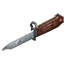 | `tacz:bayonet_6h3` | 6H3 刺刀 | 枪口 | 霰弹枪, 狙击枪, 步枪, 手枪, 机枪, 冲锋枪 |
| 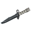 | `tacz:bayonet_m9` | M9 刺刀 | 枪口 | 霰弹枪, 狙击枪, 步枪, 手枪, 机枪, 冲锋枪 |
| 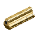 | `tacz:deagle_golden_long_barrel` | .357 黄金沙漠之鹰加长枪管 | 枪口 | 霰弹枪, 狙击枪, 步枪, 手枪, 机枪, 冲锋枪 |
|  | `tacz:extended_mag_1` | 重型弹药扩容弹匣 | 扩容弹匣 | 霰弹枪, 狙击枪, 步枪, 手枪, 机枪, 冲锋枪 |
|  | `tacz:extended_mag_2` | §9重型弹药扩容弹匣 | 扩容弹匣 | 霰弹枪, 狙击枪, 步枪, 手枪, 机枪, 冲锋枪 |
|  | `tacz:extended_mag_3` | §d重型弹药扩容弹匣 | 扩容弹匣 | 霰弹枪, 狙击枪, 步枪, 手枪, 机枪, 冲锋枪 |
|  | `tacz:grip_cobra` | SI 三角阻手 | 握把 | 霰弹枪, 机枪, 步枪, 冲锋枪 |
|  | `tacz:grip_cqr` | CQR 战术握把 | 握把 | 霰弹枪, 机枪, 步枪, 冲锋枪 |
|  | `tacz:grip_magpul_afg_2` | 塔伦 AFG2 阻手 | 握把 | 霰弹枪, 机枪, 步枪, 冲锋枪 |
|  | `tacz:grip_osovets_black` | P-2 战术垂直握把 | 握把 | 霰弹枪, 机枪, 步枪, 冲锋枪 |
|  | `tacz:grip_rk0` | RK-0 垂直握把 | 握把 | 霰弹枪, 机枪, 步枪, 冲锋枪 |
| 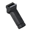 | `tacz:grip_rk1_b25u` | RK-1 斜握把 | 握把 | 霰弹枪, 机枪, 步枪, 冲锋枪 |
|  | `tacz:grip_rk6` | RK-6 轻型阻手 | 握把 | 霰弹枪, 机枪, 步枪, 冲锋枪 |
|  | `tacz:grip_se_5` | SE-5 斜握把 | 握把 | 霰弹枪, 机枪, 步枪, 冲锋枪 |
|  | `tacz:grip_td` | TD 骷髅斜握把 | 握把 | 霰弹枪, 机枪, 步枪, 冲锋枪 |
| 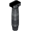 | `tacz:grip_vertical_military` | 名驹 军用制式握把 | 握把 | 霰弹枪, 机枪, 步枪, 冲锋枪 |
|  | `tacz:grip_vertical_ranger` | 科赫 游骑兵重型握把 | 握把 | 霰弹枪, 机枪, 步枪, 冲锋枪 |
|  | `tacz:grip_vertical_talon` | 塔伦 SG2 前握把 | 握把 | 霰弹枪, 机枪, 步枪, 冲锋枪 |
|  | `tacz:laser_compact` | §a米利泰克 小型激光指示器 | 激光 | 步枪, 手枪, 冲锋枪 |
| 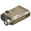 | `tacz:laser_lopro` | §5低姿战术激光指示器 | 激光 | 步枪, 手枪, 冲锋枪 |
| 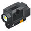 | `tacz:laser_nightstick` | §a夜槌 便携式激光指示器 | 激光 | 步枪, 手枪, 冲锋枪 |
|  | `tacz:laser_peq15` | laser_peq15 | 激光 | 步枪, 手枪, 冲锋枪 |
|  | `tacz:light_extended_mag_1` | 轻型弹药扩容弹匣 | 扩容弹匣 | 霰弹枪, 狙击枪, 步枪, 手枪, 机枪, 冲锋枪 |
|  | `tacz:light_extended_mag_2` | §9轻型弹药扩容弹匣 | 扩容弹匣 | 霰弹枪, 狙击枪, 步枪, 手枪, 机枪, 冲锋枪 |
|  | `tacz:light_extended_mag_3` | §d轻型弹药扩容弹匣 | 扩容弹匣 | 霰弹枪, 狙击枪, 步枪, 手枪, 机枪, 冲锋枪 |
|  | `tacz:muzzle_brake_cthulhu` | 克苏鲁 K7 制退器 | 枪口 | 霰弹枪, 狙击枪, 步枪, 手枪, 机枪, 冲锋枪 |
| 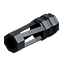 | `tacz:muzzle_brake_cyclone_d2` | 气旋 D2 枪口制退器 | 枪口 | 霰弹枪, 狙击枪, 步枪, 手枪, 机枪, 冲锋枪 |
|  | `tacz:muzzle_brake_mastiff_sg` | 獒犬 制退器 | 枪口 | 霰弹枪, 狙击枪, 步枪, 手枪, 机枪, 冲锋枪 |
| 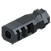 | `tacz:muzzle_brake_pioneer` | 先锋 A3 制退器 | 枪口 | 霰弹枪, 狙击枪, 步枪, 手枪, 机枪, 冲锋枪 |
| 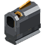 | `tacz:muzzle_brake_timeless50` | §6永恒 .50口径制退器 | 枪口 | 霰弹枪, 狙击枪, 步枪, 手枪, 机枪, 冲锋枪 |
|  | `tacz:muzzle_brake_trex` | 霸王龙 重型制退器 | 枪口 | 霰弹枪, 狙击枪, 步枪, 手枪, 机枪, 冲锋枪 |
|  | `tacz:muzzle_choke_sg` | 扼流器 | 枪口 | 霰弹枪, 狙击枪, 步枪, 手枪, 机枪, 冲锋枪 |
|  | `tacz:muzzle_compensator_trident` | 风暴 三叉戟 枪口补偿器 | 枪口 | 霰弹枪, 狙击枪, 步枪, 手枪, 机枪, 冲锋枪 |
| 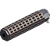 | `tacz:muzzle_silencer_knight_qd` | 骑士快拆消音器 | 枪口 | 霰弹枪, 狙击枪, 步枪, 手枪, 机枪, 冲锋枪 |
| 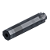 | `tacz:muzzle_silencer_mirage` | 幻象 手枪消音器 | 枪口 | 霰弹枪, 狙击枪, 步枪, 手枪, 机枪, 冲锋枪 |
| 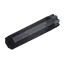 | `tacz:muzzle_silencer_phantom_s1` | 幽影 S1 消音器 | 枪口 | 霰弹枪, 狙击枪, 步枪, 手枪, 机枪, 冲锋枪 |
| 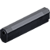 | `tacz:muzzle_silencer_ptilopsis` | PO-2 "白面鸮" 手枪消音器 | 枪口 | 霰弹枪, 狙击枪, 步枪, 手枪, 机枪, 冲锋枪 |
| 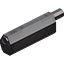 | `tacz:muzzle_silencer_sg` | 12号口径消音器 | 枪口 | 霰弹枪, 狙击枪, 步枪, 手枪, 机枪, 冲锋枪 |
| 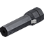 | `tacz:muzzle_silencer_ursus` | 乌萨斯制式消音器 | 枪口 | 霰弹枪, 狙击枪, 步枪, 手枪, 机枪, 冲锋枪 |
|  | `tacz:muzzle_silencer_vulture` | 秃鹫.50口径消音器 | 枪口 | 霰弹枪, 狙击枪, 步枪, 手枪, 机枪, 冲锋枪 |
|  | `tacz:oem_stock_heavy` | 原厂重型枪托 | 枪托 | 步枪, 霰弹枪, 机枪, 冲锋枪 |
|  | `tacz:oem_stock_light` | 原厂轻型枪托 | 枪托 | 步枪, 霰弹枪, 机枪, 冲锋枪 |
|  | `tacz:oem_stock_tactical` | 原厂战术枪托 | 枪托 | 步枪, 霰弹枪, 机枪, 冲锋枪 |
| 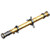 | `tacz:scope_1873_6x` | §5老式 春田神射手瞄具 | 瞄具 | 霰弹枪, 狙击枪, 步枪, 手枪, 机枪, 冲锋枪 |
| 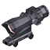 | `tacz:scope_acog_ta31` | §9TA31 2x 先进战斗光学瞄具 | 瞄具 | 霰弹枪, 狙击枪, 步枪, 手枪, 机枪, 冲锋枪 |
|  | `tacz:scope_aug_default` | AUG 内置瞄具 | 瞄具 | 霰弹枪, 狙击枪, 步枪, 手枪, 机枪, 冲锋枪 |
|  | `tacz:scope_contender` | §9竞技者 4x 光学瞄具 | 瞄具 | 霰弹枪, 狙击枪, 步枪, 手枪, 机枪, 冲锋枪 |
|  | `tacz:scope_elcan_4x` | §5埃尔坎 4x 光学瞄具 | 瞄具 | 霰弹枪, 狙击枪, 步枪, 手枪, 机枪, 冲锋枪 |
| 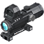 | `tacz:scope_hamr` | §5HAMR 3x 组合式光学瞄具 | 瞄具 | 霰弹枪, 狙击枪, 步枪, 手枪, 机枪, 冲锋枪 |
| 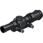 | `tacz:scope_lpvo_1_6` | §5LPVO 1-6倍瞄具  | 瞄具 | 霰弹枪, 狙击枪, 步枪, 手枪, 机枪, 冲锋枪 |
| 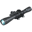 | `tacz:scope_mk5hd` | §6Mark 5 HD 5-25x 组合式光学瞄具 | 瞄具 | 霰弹枪, 狙击枪, 步枪, 手枪, 机枪, 冲锋枪 |
| 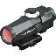 | `tacz:scope_qmk152` | §5QMK-152 3x 白光瞄准镜 | 瞄具 | 霰弹枪, 狙击枪, 步枪, 手枪, 机枪, 冲锋枪 |
|  | `tacz:scope_retro_2x` | §93x 光学瞄具"复古" | 瞄具 | 霰弹枪, 狙击枪, 步枪, 手枪, 机枪, 冲锋枪 |
| 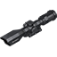 | `tacz:scope_standard_8x` | §6斥候 4-10x 光学瞄具 | 瞄具 | 霰弹枪, 狙击枪, 步枪, 手枪, 机枪, 冲锋枪 |
| 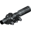 | `tacz:scope_vudu` | §6巫毒 1-6x 组合式精确瞄准镜 | 瞄具 | 霰弹枪, 狙击枪, 步枪, 手枪, 机枪, 冲锋枪 |
|  | `tacz:shotgun_extended_mag_1` | 霰弹弹药扩容弹匣 | 扩容弹匣 | 霰弹枪, 狙击枪, 步枪, 手枪, 机枪, 冲锋枪 |
|  | `tacz:shotgun_extended_mag_2` | §9霰弹弹药扩容弹匣 | 扩容弹匣 | 霰弹枪, 狙击枪, 步枪, 手枪, 机枪, 冲锋枪 |
|  | `tacz:shotgun_extended_mag_3` | §d霰弹弹药扩容弹匣 | 扩容弹匣 | 霰弹枪, 狙击枪, 步枪, 手枪, 机枪, 冲锋枪 |
|  | `tacz:sight_552` | §9EOTECH 552全息瞄具  | 瞄具 | 霰弹枪, 狙击枪, 步枪, 手枪, 机枪, 冲锋枪 |
|  | `tacz:sight_acro_pistol` | ACRO P-1 反射式瞄具 | 瞄具 | 霰弹枪, 狙击枪, 步枪, 手枪, 机枪, 冲锋枪 |
| 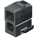 | `tacz:sight_acro_rifle` | ACRO P-1 增高 反射式瞄具 | 瞄具 | 霰弹枪, 狙击枪, 步枪, 手枪, 机枪, 冲锋枪 |
| 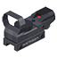 | `tacz:sight_coyote` | Coyote 红点瞄准镜 | 瞄具 | 霰弹枪, 狙击枪, 步枪, 手枪, 机枪, 冲锋枪 |
| 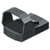 | `tacz:sight_deltapoint_pistol` | DeltaPoint 反射式瞄具 | 瞄具 | 霰弹枪, 狙击枪, 步枪, 手枪, 机枪, 冲锋枪 |
|  | `tacz:sight_deltapoint_rifle` | DeltaPoint 增高 反射式瞄具 | 瞄具 | 霰弹枪, 狙击枪, 步枪, 手枪, 机枪, 冲锋枪 |
|  | `tacz:sight_exp3` | §9EXP3全息瞄具  | 瞄具 | 霰弹枪, 狙击枪, 步枪, 手枪, 机枪, 冲锋枪 |
|  | `tacz:sight_fastfire_pistol` | FastFire 反射式瞄具 | 瞄具 | 霰弹枪, 狙击枪, 步枪, 手枪, 机枪, 冲锋枪 |
|  | `tacz:sight_fastfire_rifle` | FastFire 增高 射式瞄具 | 瞄具 | 霰弹枪, 狙击枪, 步枪, 手枪, 机枪, 冲锋枪 |
| 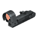 | `tacz:sight_okp7` | OKP-7 反射式瞄具 | 瞄具 | 霰弹枪, 狙击枪, 步枪, 手枪, 机枪, 冲锋枪 |
|  | `tacz:sight_p90` | sight_p90 | 瞄具 | 霰弹枪, 狙击枪, 步枪, 手枪, 机枪, 冲锋枪 |
|  | `tacz:sight_pk06_pistol` | PK06 反射式瞄具 | 瞄具 | 霰弹枪, 狙击枪, 步枪, 手枪, 机枪, 冲锋枪 |
|  | `tacz:sight_pk06_rifle` | PK06 增高 反射式瞄具 | 瞄具 | 霰弹枪, 狙击枪, 步枪, 手枪, 机枪, 冲锋枪 |
|  | `tacz:sight_rmr_dot` | RMR迷你红点瞄具  | 瞄具 | 霰弹枪, 狙击枪, 步枪, 手枪, 机枪, 冲锋枪 |
|  | `tacz:sight_sro_dot` | SRO 微型红点瞄准镜 | 瞄具 | 霰弹枪, 狙击枪, 步枪, 手枪, 机枪, 冲锋枪 |
| 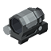 | `tacz:sight_srs_02` | SRS-02 反射式瞄具 | 瞄具 | 霰弹枪, 狙击枪, 步枪, 手枪, 机枪, 冲锋枪 |
| 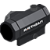 | `tacz:sight_t1` | T1封闭式红点瞄具  | 瞄具 | 霰弹枪, 狙击枪, 步枪, 手枪, 机枪, 冲锋枪 |
| 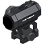 | `tacz:sight_t2` | T2封闭式红点瞄具  | 瞄具 | 霰弹枪, 狙击枪, 步枪, 手枪, 机枪, 冲锋枪 |
|  | `tacz:sight_uh1` | §9UH-1全息瞄具  | 瞄具 | 霰弹枪, 狙击枪, 步枪, 手枪, 机枪, 冲锋枪 |
|  | `tacz:sniper_extended_mag_1` | 狙击弹药扩容弹匣 | 扩容弹匣 | 霰弹枪, 狙击枪, 步枪, 手枪, 机枪, 冲锋枪 |
|  | `tacz:sniper_extended_mag_2` | §9狙击弹药扩容弹匣 | 扩容弹匣 | 霰弹枪, 狙击枪, 步枪, 手枪, 机枪, 冲锋枪 |
|  | `tacz:sniper_extended_mag_3` | §d狙击弹药扩容弹匣 | 扩容弹匣 | 霰弹枪, 狙击枪, 步枪, 手枪, 机枪, 冲锋枪 |
| 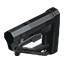 | `tacz:stock_ak12` | 伊兹玛什 战术枪托 | 枪托 | 步枪, 霰弹枪, 机枪, 冲锋枪 |
| 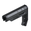 | `tacz:stock_carbon_bone_c5` | 碳骨 C5 轻型枪托 | 枪托 | 步枪, 霰弹枪, 机枪, 冲锋枪 |
| 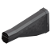 | `tacz:stock_heavy_spas_12` | 弗兰基 重型枪托 | 枪托 | 步枪, 霰弹枪, 机枪, 冲锋枪 |
| 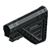 | `tacz:stock_hk_slim_line` | KS 战术枪托 | 枪托 | 步枪, 霰弹枪, 机枪, 冲锋枪 |
| 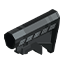 | `tacz:stock_m4ss` | M4SS 战术枪托 | 枪托 | 步枪, 霰弹枪, 机枪, 冲锋枪 |
| 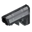 | `tacz:stock_militech_b5` | 军科 B5 战术枪托 | 枪托 | 步枪, 霰弹枪, 机枪, 冲锋枪 |
| 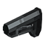 | `tacz:stock_moe` | MOE 轻型枪托 | 枪托 | 步枪, 霰弹枪, 机枪, 冲锋枪 |
| 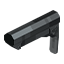 | `tacz:stock_ripstock` | RS 超轻型枪托 | 枪托 | 步枪, 霰弹枪, 机枪, 冲锋枪 |
| 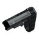 | `tacz:stock_sba3` | SBA3 枪托 | 枪托 | 步枪, 霰弹枪, 机枪, 冲锋枪 |
| 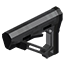 | `tacz:stock_tactical_ar` | CTR战术枪托 | 枪托 | 步枪, 霰弹枪, 机枪, 冲锋枪 |
|  | `tacz:stock_tactical_spas_12` | 弗兰基 战术枪托 | 枪托 | 步枪, 霰弹枪, 机枪, 冲锋枪 |
