# 薰衣草枪包 (lavender_converted) — 一战主题

## 🔫 枪械列表

| 图片 | NBT GunId (GunId标签) | 枪械名称 | 枪械类型 | 支持的配件槽位 |
|---|---|---|---|---|
|  | `lavender:at_vickers_crawford` | 维克斯-克劳福德反载具火箭炮 | 重型武器 | 瞄具, 枪口, 握把, 枪托, 扩容弹匣 |
|  | `lavender:berreta1915` | 波莱塔M1915半自动手枪 | 手枪 | 无 |
|  | `lavender:berretam1918` | 列维里波莱塔M1918自动装填步枪 | 冲锋枪 | 瞄具, 枪口, 握把, 枪托, 扩容弹匣 |
| 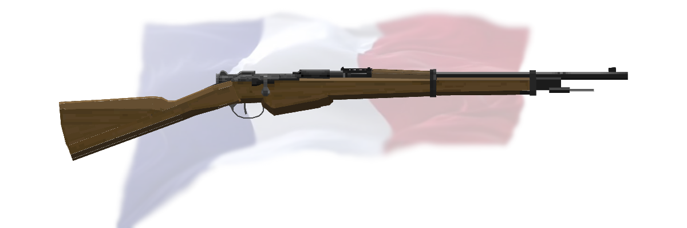 | `lavender:berthier1892` | Berthier1892贝蒂埃步枪/卡宾枪 | 步枪 | 瞄具, 枪口, 扩容弹匣 |
| 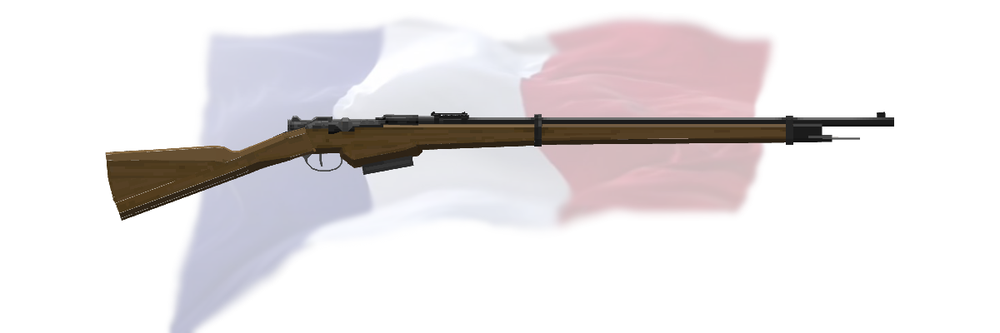 | `lavender:berthier1916` | BerthierMle1916贝蒂埃步枪 | 步枪 | 瞄具, 枪口, 握把 |
|  | `lavender:bodeo1889` | 博代奥M1889转轮手枪 | 手枪 | 无 |
|  | `lavender:browning1918` | 勃朗宁M1918自动装填步枪 | 机枪 | 瞄具, 握把, 枪口, 扩容弹匣 |
|  | `lavender:bulldog` | 斗牛犬袖珍转轮手枪 | 手枪 | 无 |
| 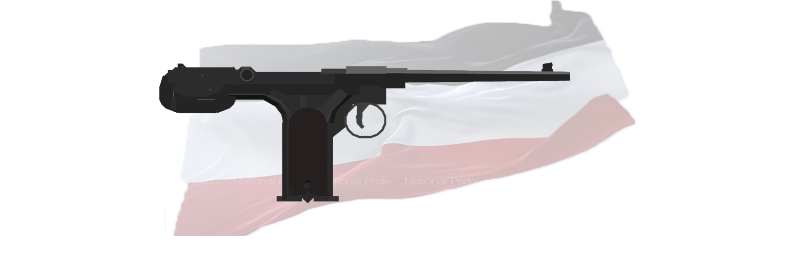 | `lavender:c93` | 博查特C93自动手枪 | 手枪 | 无 |
| 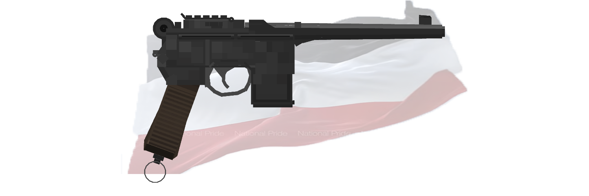 | `lavender:c96` | 毛瑟C96手枪 | 手枪 | 无 |
| 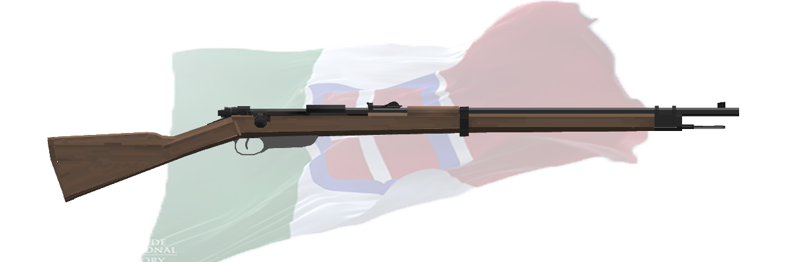 | `lavender:carcanom1891` | 卡尔卡诺M1891步枪 | 步枪 | 瞄具, 枪口, 握把 |
| 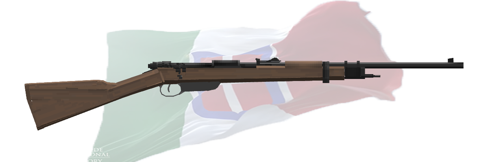 | `lavender:carcanom1891_2` | 卡尔卡诺M1891卡宾枪 | 步枪 | 瞄具, 枪口 |
| 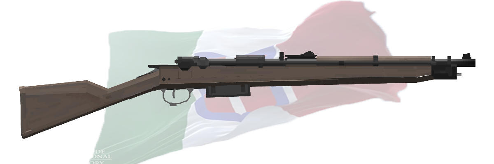 | `lavender:cei_rigotti` | 希-瑞戈蒂Cei_Rigotti(全)/半自动装填步枪 | 步枪 | 瞄具, 枪口, 扩容弹匣, 握把 |
| 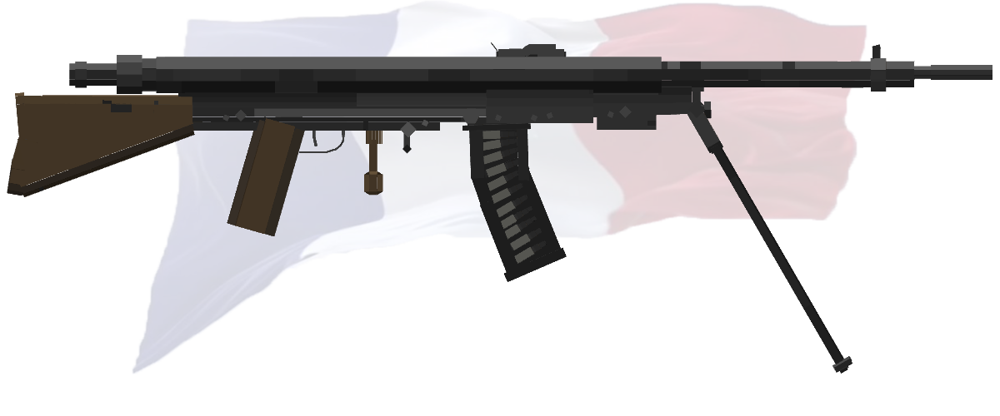 | `lavender:chauchat` | 绍沙M915轻机枪(改进型) | 机枪 | 瞄具, 握把, 枪口, 扩容弹匣 |
| 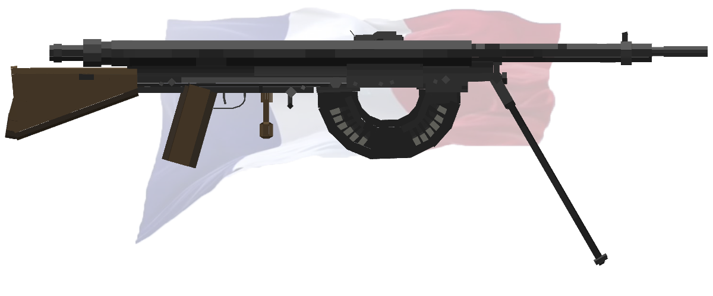 | `lavender:chauchat2` | 绍沙M1915轻机枪 | 机枪 | 瞄具, 握把, 枪口, 扩容弹匣 |
| 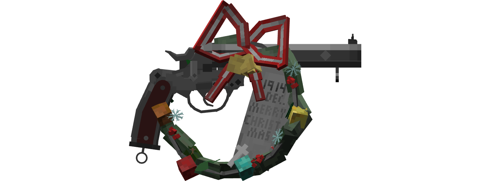 | `lavender:christmas2025` | 2025圣诞节彩蛋-圣诞停战夜 | 重型武器 | 瞄具, 枪口, 握把, 枪托, 扩容弹匣 |
| 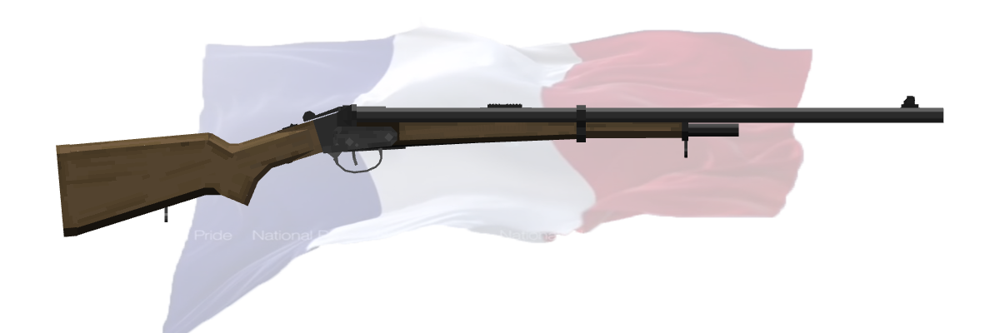 | `lavender:darne1912` | 达恩Darne1912猎枪 | 霰弹枪 | 枪口, 扩容弹匣, 瞄具 |
|  | `lavender:enfieldm1917` | 恩菲尔德P-14步枪 | 步枪 | 瞄具, 枪口, 握把 |
|  | `lavender:enfieldm1917_2` | 恩菲尔德P-14卡宾枪 | 步枪 | 瞄具, 枪口, 握把 |
|  | `lavender:enfieldm1917_3` | 恩菲尔德M1917步枪 | 步枪 | 瞄具, 枪口, 握把 |
|  | `lavender:enfieldm1917_4` | 恩菲尔德M1917卡宾枪 | 步枪 | 瞄具, 枪口, 握把 |
|  | `lavender:farquharhill` | 法夸尔·希尔导气步枪 | 步枪 | 瞄具, 枪口, 握把 |
|  | `lavender:frommer1912` | 菲罗梅尔M1912停止手枪 | 手枪 | 无 |
|  | `lavender:frommer1912_auto` | 菲罗梅尔M1912停止手枪(全自动) | 手枪 | 无 |
|  | `lavender:gasser1870` | 嘉瑟尔-克罗帕切克M1870转轮手枪 | 手枪 | 无 |
|  | `lavender:gasser1870_2` | 嘉瑟尔-克罗帕切克M1870/84转轮手枪 | 手枪 | 无 |
| 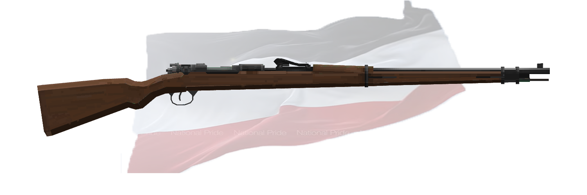 | `lavender:gewehr98` | 格维尔毛瑟gewehr98步枪 | 步枪 | 瞄具, 枪口, 握把 |
| 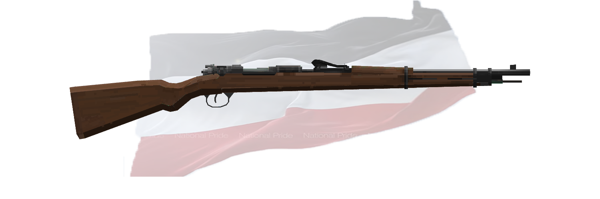 | `lavender:gewehr98b` | 毛瑟格韦尔98卡宾枪 | 步枪 | 扩容弹匣, 瞄具, 枪口 |
| 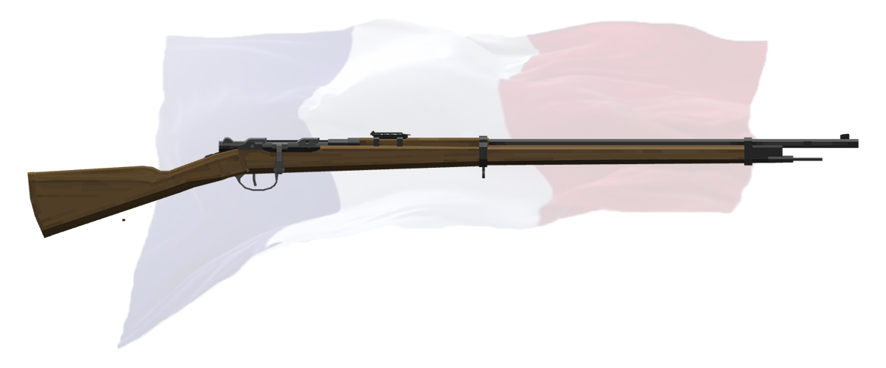 | `lavender:gras1874` | 格拉斯1874/14步枪 | 步枪 | 瞄具, 枪口, 握把 |
|  | `lavender:grisenti1910` | 格里森蒂半自动手枪 | 手枪 | 无 |
| 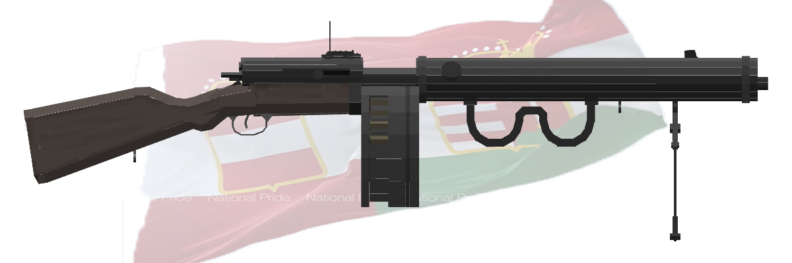 | `lavender:hellriegel1915` | 赫尔里格尔1915水冷冲锋枪(轻机枪型) | 机枪 | 瞄具, 握把, 枪口, 扩容弹匣 |
|  | `lavender:hellriegel1915_2` | 赫尔里格尔1915水冷冲锋枪 | 冲锋枪 | 瞄具, 握把, 枪口, 扩容弹匣 |
| 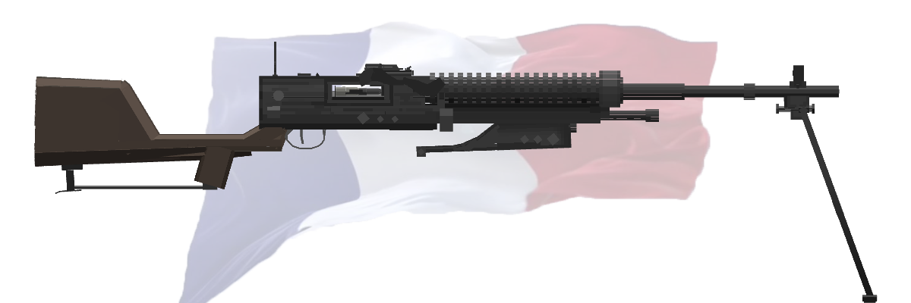 | `lavender:hotchkiss` | 哈奇开斯m1909机枪(輕量化) | 机枪 | 瞄具, 握把, 枪口, 扩容弹匣 |
|  | `lavender:howell` | 李-恩菲尔德mk3-豪威尔半自动装填型 | 步枪 | 瞄具, 枪口, 握把 |
|  | `lavender:kar98k` | kar98k | 步枪 | 瞄具, 枪口 |
|  | `lavender:karabiner88` | M1888/05委员会卡宾枪 | 步枪 | 瞄具, 枪口 |
| 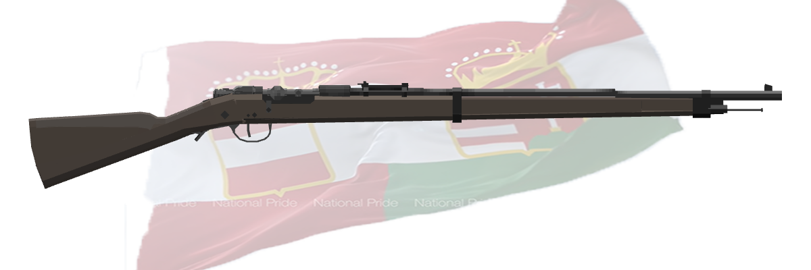 | `lavender:kropatschek` | 克罗帕斯克M1878步枪 | 步枪 | 瞄具, 枪口, 握把 |
| 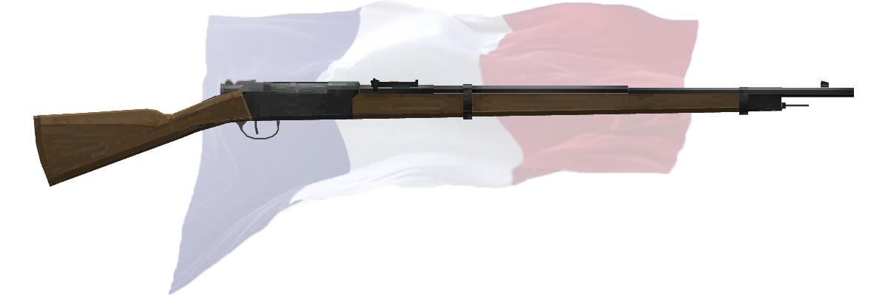 | `lavender:lebel` | 勒贝尔LebelM1886步枪 | 步枪 | 瞄具, 枪口, 握把 |
| 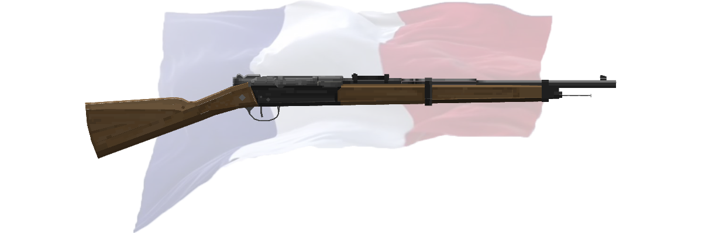 | `lavender:lebel1893` | 勒贝尔LebelM1886/93(卡宾) | 步枪 | 瞄具, 枪口 |
| 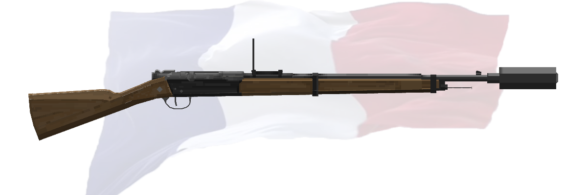 | `lavender:lebel_vb` | 维文-贝希耶尔(VB)枪榴弹发射器 | 重型武器 | 瞄具 |
|  | `lavender:lee_metford` | 李-梅特福步枪 | 步枪 | 瞄具, 枪口, 握把 |
| 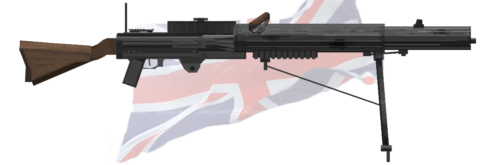 | `lavender:lewis` | 刘易斯式轻机枪 | 机枪 | 瞄具, 握把, 枪口, 扩容弹匣 |
|  | `lavender:m1879` | M1879帝国转轮手枪 | 手枪 | 无 |
| 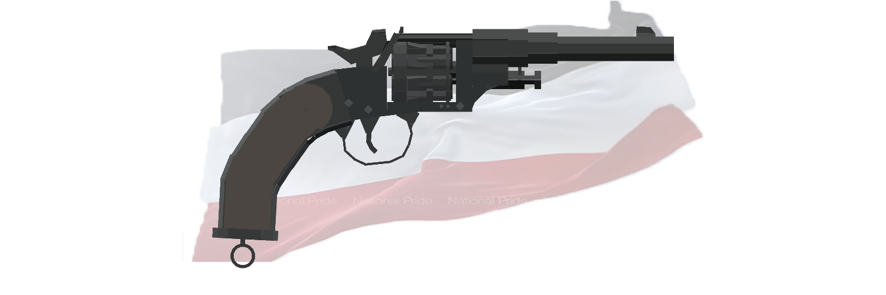 | `lavender:m1883` | M1883转轮手枪 | 手枪 | 无 |
| 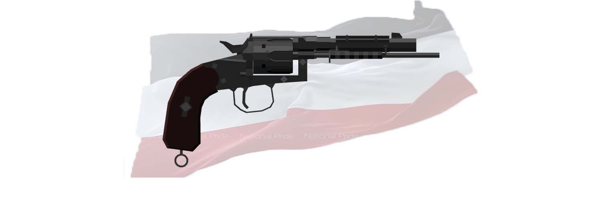 | `lavender:m1883_2` | M1883转轮手枪(加长) | 手枪 | 无 |
|  | `lavender:m1888` | M1888/05委员会步枪 | 步枪 | 瞄具, 枪口, 握把 |
| 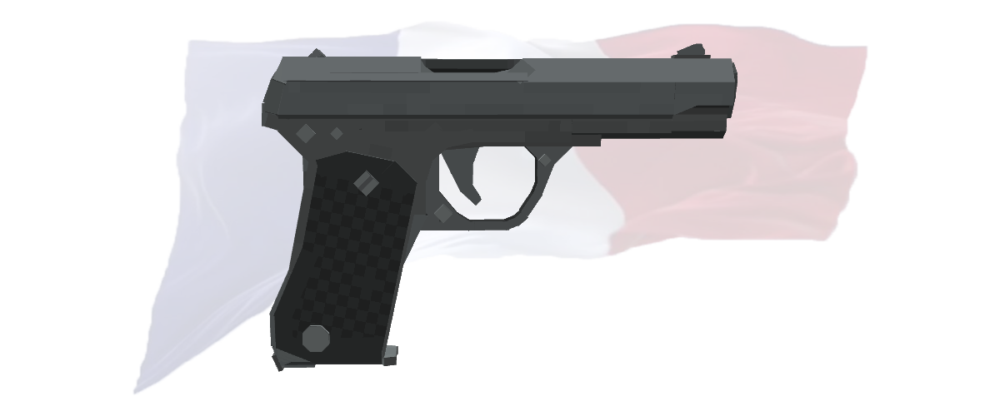 | `lavender:m1914ruby` | M1914Ruby红宝石手枪 | 手枪 | 无 |
|  | `lavender:m1917carbin` | 毛瑟C96卡宾枪 | 手枪 | 无 |
|  | `lavender:m1918` | 毛瑟M1918反坦克步枪 | 步枪 | 瞄具, 扩容弹匣 |
|  | `lavender:mannlicher_schonauer` | 曼利夏-舍瑙尔Y1903/14步枪 | 步枪 | 瞄具, 枪口, 握把 |
|  | `lavender:mannlicher_schonauer_2` | 曼利夏-舍瑙尔Y1903/14卡宾枪 | 步枪 | 瞄具, 枪口, 握把 |
| 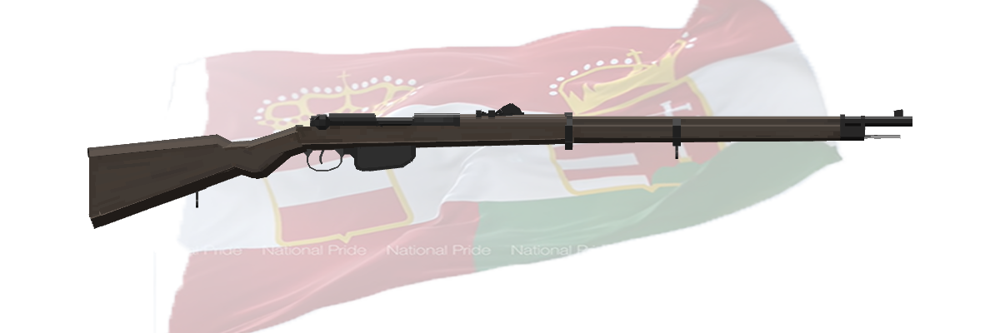 | `lavender:mannlicherm1888` | 斯太尔-曼利彻M1888/90步枪 | 步枪 | 瞄具, 枪口, 握把 |
|  | `lavender:mars` | 韦伯利—马鲁斯半自动手枪 | 手枪 | 无 |
|  | `lavender:martini` | 马提尼-亨利杠杆步枪 | 步枪 | 瞄具, 枪口, 握把 |
| 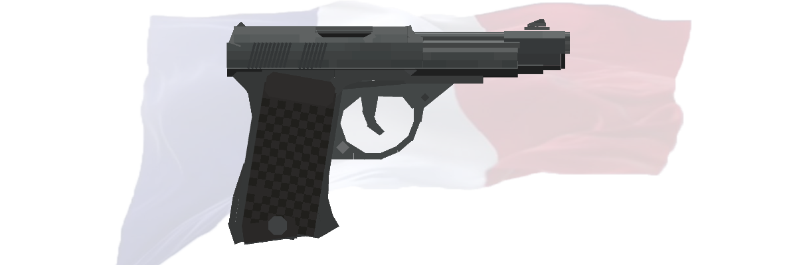 | `lavender:martinm1905` | 伯纳德-马丁M1905型手枪 | 手枪 | 无 |
|  | `lavender:mas1873` | 圣埃蒂安'夏梅洛-德尔维涅'Mas1873右轮手枪 | 手枪 | 无 |
| 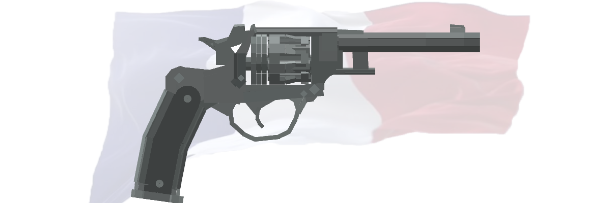 | `lavender:mas1892` | 圣埃蒂安Mas1892右轮手枪 | 手枪 | 无 |
|  | `lavender:mas1892c` | 圣埃蒂安Mas1892右轮手枪(加長) | 手枪 | 无 |
|  | `lavender:mauser1914` | 毛瑟1914手枪 | 手枪 | 无 |
|  | `lavender:mauserselbstladerm1916` | selbstlader毛瑟m1916半自动装填步枪 | 步枪 | 枪口, 瞄具, 握把 |
| 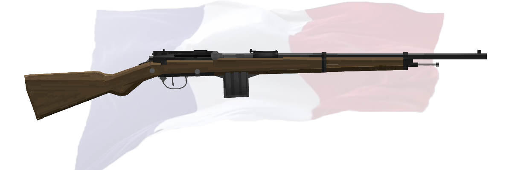 | `lavender:meunier1910` | Meunier梅尼耶尔1910A6半自动装填步枪 | 步枪 | 瞄具, 枪口, 扩容弹匣, 握把 |
| 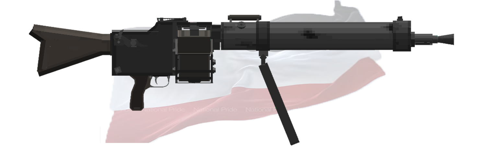 | `lavender:mg0815` | 伯格曼MG08/15重型机枪 | 机枪 | 瞄具, 握把, 枪口, 扩容弹匣 |
| 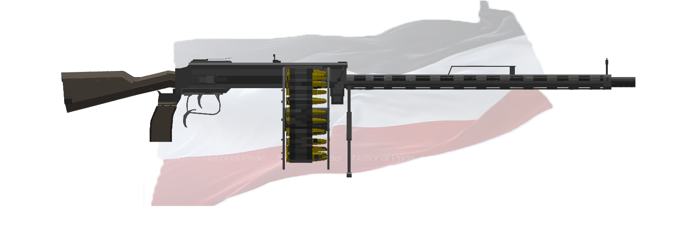 | `lavender:mg1417` | 伯格曼MG14/17轻型机枪 | 机枪 | 瞄具, 握把, 枪口, 扩容弹匣 |
|  | `lavender:mg15na` | 伯格曼MG15N.a轻机枪 | 机枪 | 瞄具, 握把, 枪口, 扩容弹匣 |
| 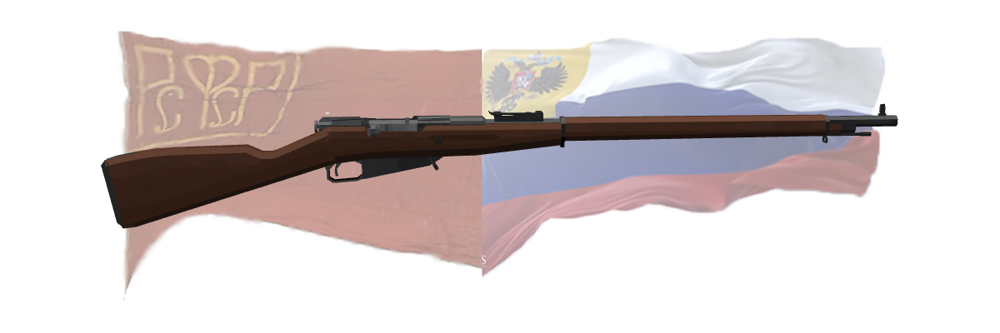 | `lavender:mosin1891` | 莫辛-纳甘M1891步枪 | 步枪 | 瞄具, 枪口, 握把 |
| 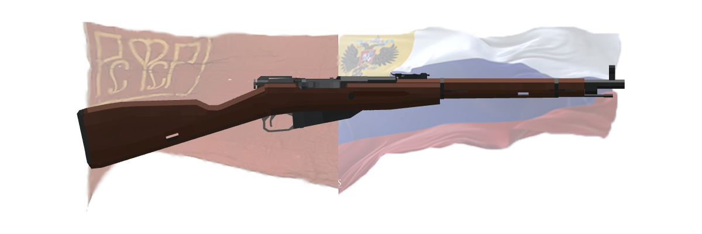 | `lavender:mosin1907` | 莫辛-纳甘M1907卡宾枪 | 步枪 | 瞄具, 枪口, 握把 |
|  | `lavender:mosin_dra` | 莫辛-纳甘骑枪(龙骑兵型) | 步枪 | 瞄具, 枪口, 握把 |
|  | `lavender:mp18` | 伯格曼Mp18冲锋枪 | 冲锋枪 | 瞄具, 枪口, 握把, 枪托, 扩容弹匣 |
|  | `lavender:nagant1895` | 纳甘M1895转轮手枪 | 手枪 | 无 |
|  | `lavender:obrez` | Obrez莫辛纳甘截短手枪 | 手枪 | 瞄具, 枪口 |
|  | `lavender:ovp_smg` | ovp自动装填冲锋枪 | 冲锋枪 | 瞄具, 枪口, 握把, 枪托, 扩容弹匣 |
|  | `lavender:p08` | 鲁格P08手枪 | 手枪 | 无 |
| 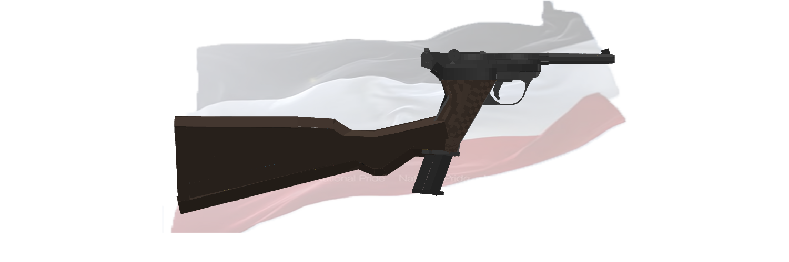 | `lavender:p082` | 鲁格P08載具卡賓槍 | 手枪 | 瞄具, 枪口, 扩容弹匣 |
|  | `lavender:perino1908` | 佩里诺m1908重机枪(轻量化) | 机枪 | 瞄具, 握把, 枪口, 扩容弹匣 |
| 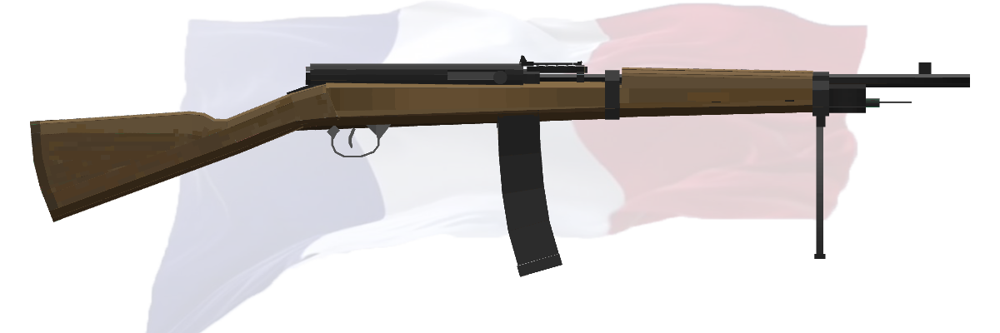 | `lavender:ribeyrolles1918` | 利贝罗勒M1918自动装填步枪 | 冲锋枪 | 瞄具, 枪口, 握把, 枪托, 扩容弹匣 |
| 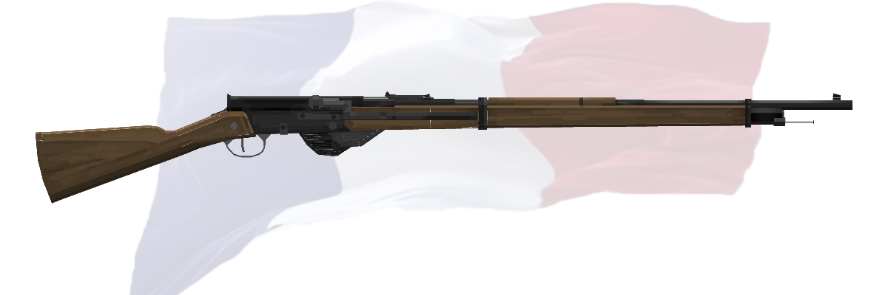 | `lavender:rsc` | RSC1917半自动装填步枪 | 步枪 | 瞄具, 枪口, 握把 |
| 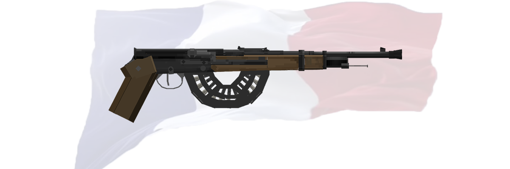 | `lavender:rsc2` | RSC冲锋枪 | 冲锋枪 | 瞄具, 枪口, 握把, 枪托, 扩容弹匣 |
|  | `lavender:schilt` | 希尔特No.3bis火焰喷射器(轻量化) | 重型武器 | 无 |
|  | `lavender:selbstladerc98` | Mauser毛瑟C98半自动步枪 | 步枪 | 瞄具, 枪口, 扩容弹匣, 握把 |
|  | `lavender:selbstladerm1906` | selbstlader鲁格m1906半自动装填步枪 | 步枪 | 瞄具, 枪口, 扩容弹匣, 握把 |
|  | `lavender:signal_gun` | 信号枪 | 重型武器 | 瞄具, 枪口, 握把, 枪托, 扩容弹匣 |
| 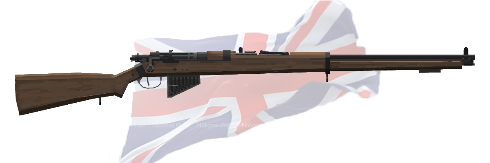 | `lavender:smle_iii` | Smle_MkIII/Lee.Enfield李.恩菲尔德步枪 | 步枪 | 瞄具, 枪口, 握把 |
|  | `lavender:smle_iii_2` | Smle_MkIII/Lee.Enfield李.恩菲尔德卡宾枪 | 步枪 | 瞄具, 枪口 |
| 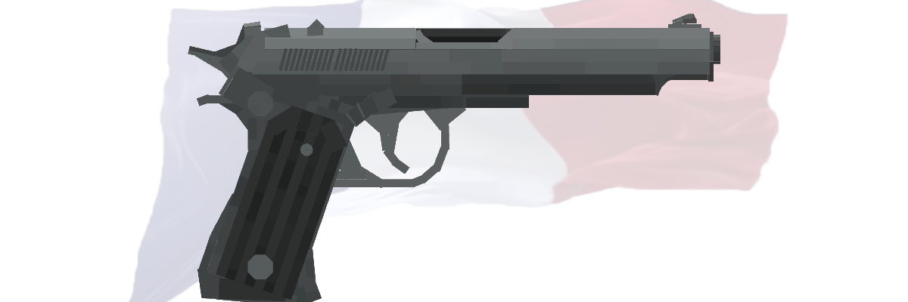 | `lavender:star` | 超级明星-半自动手枪 | 手枪 | 无 |
|  | `lavender:steyr1901` | 罗斯-斯太尔M1901半自动手枪 | 手枪 | 无 |
| 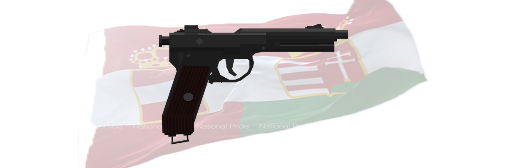 | `lavender:steyr1907` | 罗斯-斯太尔M1907半自动手枪 | 手枪 | 无 |
| 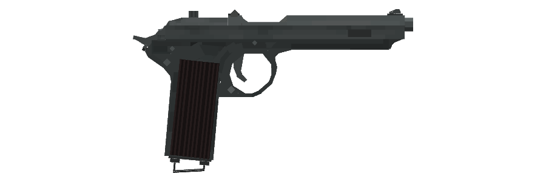 | `lavender:steyr1912` | 罗斯-斯太尔M1912半自动手枪 | 手枪 | 无 |
| 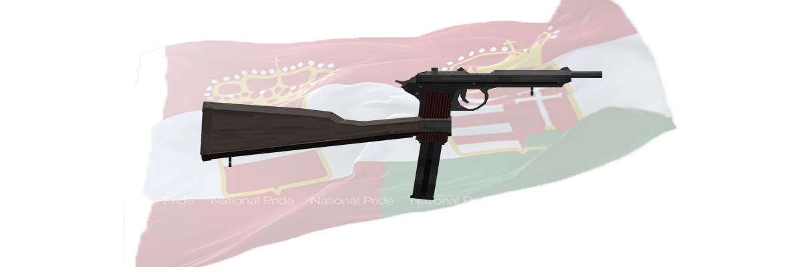 | `lavender:steyr1912_trench` | 罗斯-斯太尔M1912半自动手枪(战壕) | 手枪 | 无 |
| 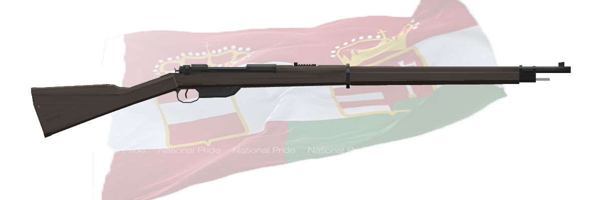 | `lavender:steyrmannlicherm1895` | 斯太尔-曼利彻M1895式步枪 | 步枪 | 瞄具, 枪口, 握把 |
|  | `lavender:steyrmannlicherm1895_2` | 斯太尔-曼利彻M1895卡宾枪 | 步枪 | 瞄具, 枪口, 握把 |
| 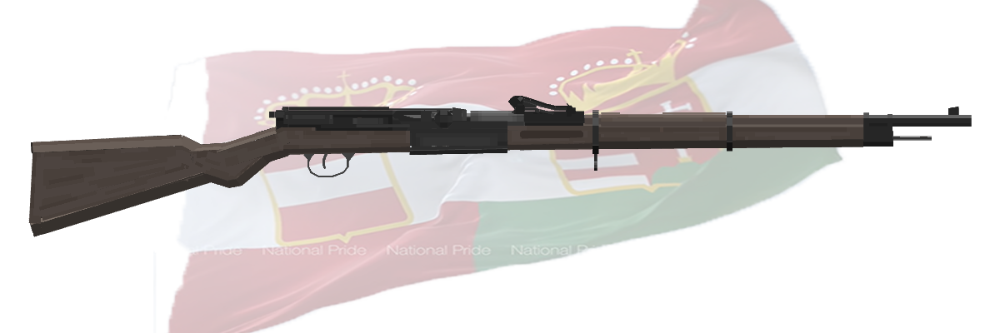 | `lavender:steyrmannlicherm1905` | 斯太尔-曼利彻M1905式实验性半自动步枪 | 步枪 | 瞄具, 枪口, 握把 |
| 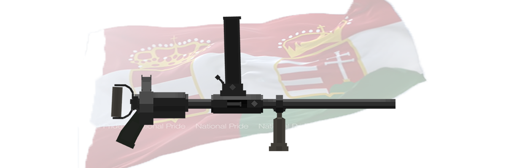 | `lavender:sturmpistole1918` | sturmpistole1918(轻量化) | 冲锋枪 | 瞄具, 枪口, 握把, 枪托, 扩容弹匣 |
| 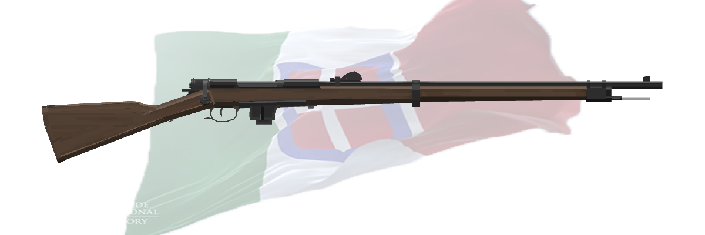 | `lavender:vetterli1870` | 维特利M1870/87步枪 | 步枪 | 瞄具, 枪口, 握把 |
| 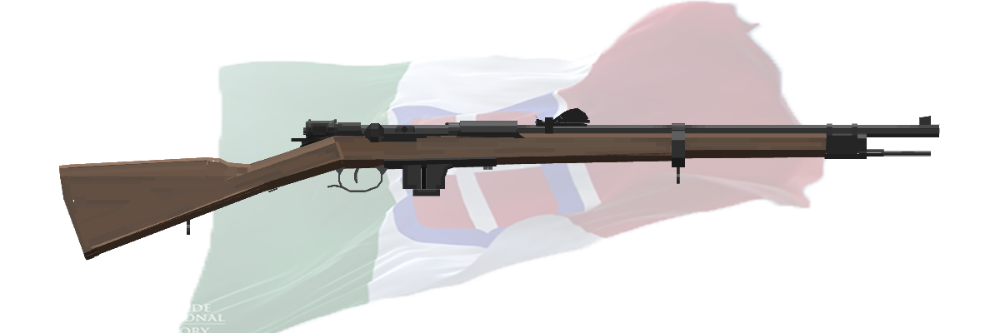 | `lavender:vetterli1887` | 维特利M1870/87/15卡宾枪 | 步枪 | 瞄具, 枪口, 握把 |
| 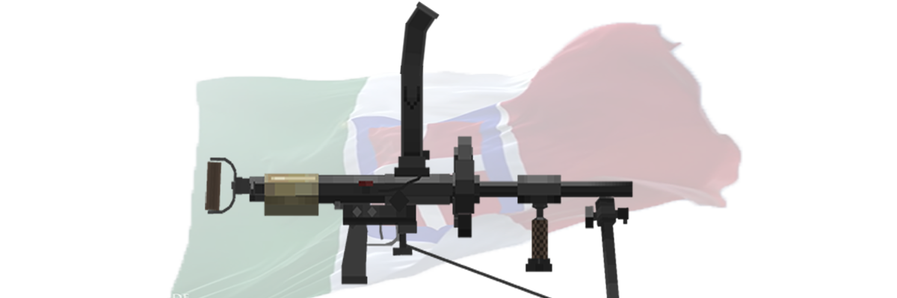 | `lavender:viller_perosa` | 维勒佩洛萨M1915轻机枪(冲锋枪) | 机枪 | 瞄具, 枪口, 握把, 枪托, 扩容弹匣 |
|  | `lavender:webleymk1` | 韦伯利斯科特MK I 自动手枪 | 手枪 | 无 |
|  | `lavender:webleymk6` | 韦伯利MK VI 转轮手枪 | 手枪 | 无 |
| 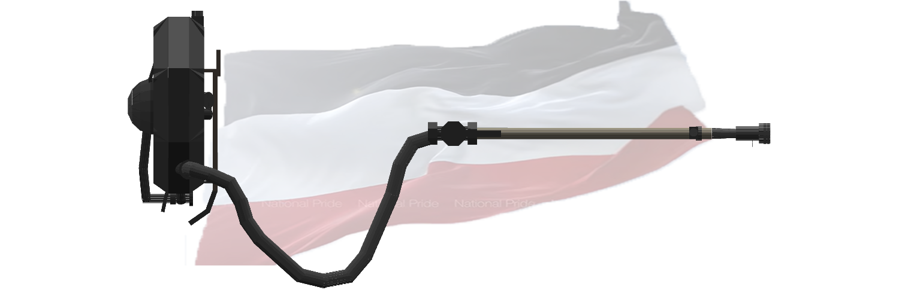 | `lavender:wex` | WEX火焰喷射器 | 重型武器 | 无 |
| 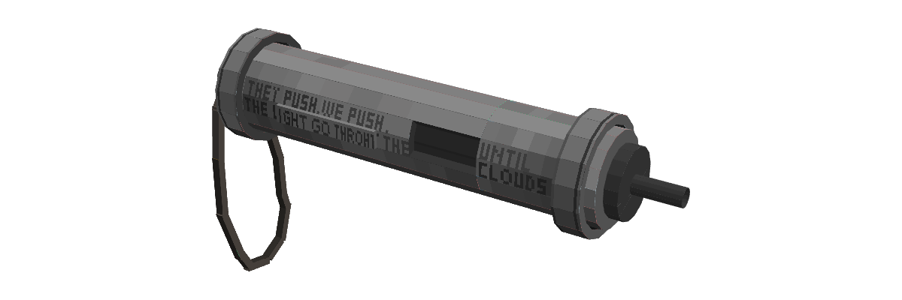 | `lavender:whistle` | 战壕哨(催命哨) | 重型武器 | 瞄具 |
| 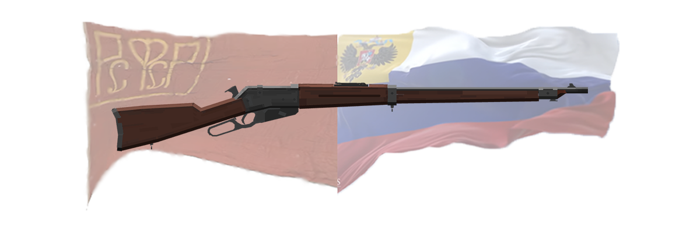 | `lavender:winchester1895` | 温彻斯特M1895杠杆步枪 | 步枪 | 瞄具, 枪口, 握把 |

## 🔧 配件列表

| 图片 | 配件ID | 配件名称 | 配件类型 | 适配的枪械类型 |
|---|---|---|---|---|
|  | `lavender:carcano_bayonet` | 卡尔卡诺m1891步枪刺刀 | 枪口 | 重型武器, 冲锋枪, 步枪, 机枪, 霰弹枪, 手枪 |
|  | `lavender:g98_bayonet` | Gewehr98步枪羽背刺刀 | 枪口 | 重型武器, 冲锋枪, 步枪, 机枪, 霰弹枪, 手枪 |
|  | `lavender:lebel_bayonet` | LebelM1886步枪林白棱刺刃 | 枪口 | 重型武器, 冲锋枪, 步枪, 机枪, 霰弹枪, 手枪 |
|  | `lavender:mannlicher_bayonet` | 曼利彻gewehr95刺刀 | 枪口 | 重型武器, 冲锋枪, 步枪, 机枪, 霰弹枪, 手枪 |
|  | `lavender:martini_bayonet` | 恩菲尔德马提尼P1885刺刀 | 枪口 | 重型武器, 冲锋枪, 步枪, 机枪, 霰弹枪, 手枪 |
|  | `lavender:mosin_bayonet` | 莫辛纳甘M91刺刀 | 枪口 | 重型武器, 冲锋枪, 步枪, 机枪, 霰弹枪, 手枪 |
|  | `lavender:mp18_bayonet` | 伯格曼Mp18刺刀 | 枪口 | 重型武器, 冲锋枪, 步枪, 机枪, 霰弹枪, 手枪 |
|  | `lavender:scope_lmgs_x2` | 轻机枪2倍瞄具 | 瞄具 | 重型武器, 冲锋枪, 步枪, 机枪, 霰弹枪, 手枪 |
|  | `lavender:scope_rifles_x3` | 直式制式步枪3倍瞄具 | 瞄具 | 重型武器, 冲锋枪, 步枪, 机枪, 霰弹枪, 手枪 |
|  | `lavender:scope_rifles_x3_2` | 斜式制式步枪3倍瞄具 | 瞄具 | 重型武器, 冲锋枪, 步枪, 机枪, 霰弹枪, 手枪 |
|  | `lavender:scope_rifles_x4` | 直式制式步枪4倍瞄具 | 瞄具 | 重型武器, 冲锋枪, 步枪, 机枪, 霰弹枪, 手枪 |
|  | `lavender:scope_rifles_x4_2` | 斜式制式步枪4倍瞄具 | 瞄具 | 重型武器, 冲锋枪, 步枪, 机枪, 霰弹枪, 手枪 |
|  | `lavender:scope_rifles_x6` | 直式制式步枪6倍瞄具 | 瞄具 | 重型武器, 冲锋枪, 步枪, 机枪, 霰弹枪, 手枪 |
|  | `lavender:scope_rifles_x6_2` | 斜式制式步枪6倍瞄具 | 瞄具 | 重型武器, 冲锋枪, 步枪, 机枪, 霰弹枪, 手枪 |
|  | `lavender:scope_rifles_x8` | 直式制式步枪8倍瞄具 | 瞄具 | 重型武器, 冲锋枪, 步枪, 机枪, 霰弹枪, 手枪 |
|  | `lavender:scope_rifles_x8_2` | 斜式制式步枪8倍瞄具 | 瞄具 | 重型武器, 冲锋枪, 步枪, 机枪, 霰弹枪, 手枪 |
|  | `lavender:semi_rifles_scope_x2` | 半自动步枪/SMG2倍瞄具 | 瞄具 | 重型武器, 冲锋枪, 步枪, 机枪, 霰弹枪, 手枪 |
|  | `lavender:smle_bayonet` | 恩菲尔德M1907刺刀 | 枪口 | 重型武器, 冲锋枪, 步枪, 机枪, 霰弹枪, 手枪 |
|  | `lavender:sniper_bracket` | 狙击型步枪支架 | 握把 | 重型武器, 冲锋枪, 步枪, 机枪 |
