# 启示录枪包 (Apocalypse v1.1.7) — BF1 一战/二战主题

## 🔫 枪械列表

| 图片 | NBT GunId (GunId标签) | 枪械名称 | 枪械类型 | 支持的配件槽位 |
|---|---|---|---|---|
| 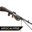 | `bf1:chauchat` | 绍沙 轻机枪 | 机枪 | 握把, 瞄具, 枪托, 扩容弹匣 |
| 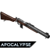 | `bf1:de_lisle` | 德利尔 微声卡宾枪 | 步枪 | 扩容弹匣, 瞄具 |
| 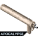 | `bf1:ef46` | 46型冲锋火焰喷射器 | 霰弹枪 | 无 |
| 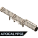 | `bf1:f_faust` | 刺拳防空火箭筒B型 | 重型武器 | 无 |
|  | `bf1:handgun` | “手”枪 | 手枪 | 枪口 |
| 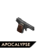 | `bf1:kolibri` | 蜂鸟 手枪 | 手枪 | 扩容弹匣 |
| 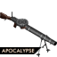 | `bf1:lewis` | 刘易斯 轻机枪 | 机枪 | 瞄具, 枪托, 扩容弹匣 |
| 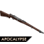 | `bf1:liu` | 刘将军步枪 | 步枪 | 瞄具, 握把, 枪口 |
| 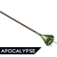 | `bf1:lunge_mine` | 四式反坦克刺雷 | 重型武器 | 无 |
| 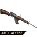 | `bf1:m1916` | M1916 自动装填步枪 | 步枪 | 瞄具, 握把, 枪口 |
| 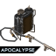 | `bf1:m2_2` | M2 火焰喷射器 | 霰弹枪 | 无 |
| 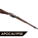 | `bf1:man_m95` | 曼利夏 M1895 步枪 | 狙击枪 | 瞄具, 枪口 |
| 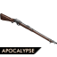 | `bf1:martini` | 马提尼-亨利 步枪 | 狙击枪 | 瞄具, 握把, 枪口 |
| 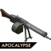 | `bf1:mg0815` | MG08/15 机枪 | 机枪 | 握把, 瞄具, 枪托, 枪口, 扩容弹匣 |
| 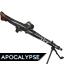 | `bf1:mg42` | MG42 通用机枪 | 机枪 | 瞄具, 握把, 扩容弹匣 |
| 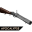 | `bf1:mhgl` | 马提尼-亨利 步枪榴弹发射器 | 重型武器 | 瞄具 |
| 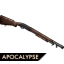 | `bf1:model10` | Model 10-A 霰弹枪 | 霰弹枪 | 扩容弹匣, 瞄具, 枪托, 枪口, 握把 |
| 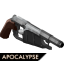 | `bf1:obrez` | 莫辛-纳甘截短手枪 | 手枪 | 瞄具, 枪口, 扩容弹匣, 激光 |
| 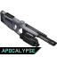 | `bf1:rorsch_mk4` | 罗氏 Mk-4 轨道炮 | 狙击枪 | 瞄具, 激光, 扩容弹匣 |
| 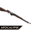 | `bf1:rsc1917` | RSC 1917 半自动步枪 | 步枪 | 瞄具, 握把, 枪口 |
| 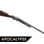 | `bf1:sjogren` | 舍格伦 惯性霰弹枪 | 霰弹枪 | 扩容弹匣, 枪口 |
| 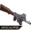 | `bf1:smg0818` | SMG08/18 冲锋枪 | 冲锋枪 | 瞄具, 握把, 枪口 |
| 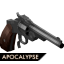 | `bf1:sw_model3` | 3号左轮手枪 | 手枪 | 枪托, 扩容弹匣 |
| 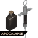 | `bf1:syringe` | 医疗用针筒 | 手枪 | 无 |
| 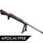 | `bf1:tg1918` | M1918 反坦克步枪 | 狙击枪 | 瞄具, 握把, 枪口, 扩容弹匣 |
| 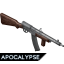 | `bf1:vg15` | VG1-5 人民突击步枪 | 步枪 | 瞄具, 枪托, 枪口, 握把, 扩容弹匣 |
| 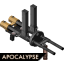 | `bf1:vp1915` | 维拉·佩罗萨 冲锋枪 | 冲锋枪 | 瞄具, 枪托, 握把, 枪口, 扩容弹匣 |
| 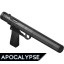 | `bf1:welrod` | 威尔洛德 微声手枪 | 手枪 | 瞄具 |
| 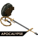 | `bf1:wex` | Wex 火焰喷射器 | 霰弹枪 | 无 |
| 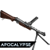 | `bf1:zk383` | ZK-383 冲锋枪 | 冲锋枪 | 瞄具, 枪口, 握把, 扩容弹匣 |

## 🔧 配件列表

| 图片 | 配件ID | 配件名称 | 配件类型 | 适配的枪械类型 |
|---|---|---|---|---|
|  | `bf1:ammo_mod_chauchat` | §e轻型枪机 | 扩容弹匣 | 机枪, 步枪, 手枪, 霰弹枪, 狙击枪, 冲锋枪 |
|  | `bf1:bayonet_general` | 原厂刺刀 | 枪口 | 手枪, 步枪, 狙击枪, 机枪, 霰弹枪, 冲锋枪 |
|  | `bf1:grip_light_bipods` | 原厂轻型脚架 | 握把 | 机枪, 步枪, 狙击枪, 霰弹枪, 冲锋枪 |
|  | `bf1:grip_trench_bipods` | 原厂重型脚架 | 握把 | 机枪, 步枪, 狙击枪, 霰弹枪, 冲锋枪 |
| 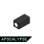 | `bf1:laser_integrated` | §55毫瓦 内嵌式激光指示器 | 激光 | 手枪, 狙击枪 |
| 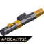 | `bf1:marksman_scope` | §6PPCo 2.5-4x 光学瞄具 | 瞄具 | 机枪, 步枪, 狙击枪, 重型武器, 霰弹枪, 手枪, 冲锋枪 |
|  | `bf1:oem_muzzle_choke` | 原厂扼流器 | 枪口 | 手枪, 步枪, 狙击枪, 机枪, 霰弹枪, 冲锋枪 |
| 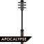 | `bf1:raider_club` | §6战壕奇兵棒 | 枪托 | 机枪, 霰弹枪, 手枪, 步枪, 冲锋枪 |
| 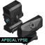 | `bf1:scope_nvk_nxt` | §9NVK-NXT 2x 复合瞄具 | 瞄具 | 机枪, 步枪, 狙击枪, 重型武器, 霰弹枪, 手枪, 冲锋枪 |
| 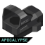 | `bf1:sight_fusion_holo` | 融合全息准镜 | 瞄具 | 机枪, 步枪, 狙击枪, 重型武器, 霰弹枪, 手枪, 冲锋枪 |
| 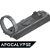 | `bf1:sight_nydar` | Nydar M47 反射式瞄具 | 瞄具 | 机枪, 步枪, 狙击枪, 重型武器, 霰弹枪, 手枪, 冲锋枪 |
| 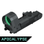 | `bf1:sight_okp8` | K8 增高 全息准镜 | 瞄具 | 机枪, 步枪, 狙击枪, 重型武器, 霰弹枪, 手枪, 冲锋枪 |
| 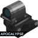 | `bf1:sight_reflector` | RAF 反射式瞄具 | 瞄具 | 机枪, 步枪, 狙击枪, 重型武器, 霰弹枪, 手枪, 冲锋枪 |
| 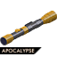 | `bf1:sniper_scope` | §6PPCo 6-10x 光学瞄具 | 瞄具 | 机枪, 步枪, 狙击枪, 重型武器, 霰弹枪, 手枪, 冲锋枪 |
