# 所有枪包综合概览

## 🔫 全部枪械总表

| 所属枪包 | 图片 | NBT GunId (GunId标签) | 枪械名称 | 枪械类型 | 支持的配件槽位 |
|---|---|---|---|---|---|
| TACZ默认枪包 | 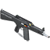 | `tacz:aa12` | AA12 霰弹枪 | 霰弹枪 | 瞄具, 扩容弹匣, 握把, 枪口 |
| TACZ默认枪包 |  | `tacz:ai_awp` | 精密国际 AWM 狙击步枪 | 狙击枪 | 扩容弹匣, 瞄具, 枪口 |
| TACZ默认枪包 | 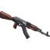 | `tacz:ak47` | AKM 突击步枪 | 步枪 | 瞄具, 枪托, 枪口, 扩容弹匣 |
| TACZ默认枪包 | 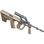 | `tacz:aug` | AUG 突击步枪 | 步枪 | 枪口, 扩容弹匣, 激光 |
| TACZ默认枪包 | 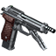 | `tacz:b93r` | B93R 冲锋手枪 | 手枪 | 枪口, 瞄具, 扩容弹匣 |
| TACZ默认枪包 | 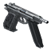 | `tacz:cz75` | CZ 75 自动手枪 | 手枪 | 瞄具, 扩容弹匣 |
| TACZ默认枪包 |  | `tacz:db_long` | DB-4 乌萨斯 | 霰弹枪 | 扩容弹匣 |
| TACZ默认枪包 | 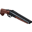 | `tacz:db_short` | DB-2 杜林人 | 霰弹枪 | 枪托, 扩容弹匣 |
| TACZ默认枪包 | 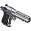 | `tacz:deagle` | .50 沙漠之鹰 | 手枪 | 瞄具, 枪口, 扩容弹匣, 激光 |
| TACZ默认枪包 | 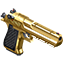 | `tacz:deagle_golden` | .357 黄金沙漠之鹰 | 手枪 | 瞄具, 枪口, 扩容弹匣, 激光 |
| TACZ默认枪包 | 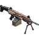 | `tacz:fn_evolys` | FN EVOLYS 机枪 | 机枪 | 瞄具, 握把, 枪口, 扩容弹匣, 枪托 |
| TACZ默认枪包 | 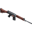 | `tacz:fn_fal` | FN FAL 战斗步枪 | 步枪 | 瞄具, 激光, 握把, 枪口, 扩容弹匣 |
| TACZ默认枪包 | 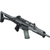 | `tacz:g36k` | G36K 突击步枪 | 步枪 | 瞄具, 枪托, 握把, 枪口, 扩容弹匣, 激光 |
| TACZ默认枪包 | 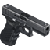 | `tacz:glock_17` | 格洛克 17 手枪 | 手枪 | 瞄具, 枪口, 扩容弹匣, 激光 |
| TACZ默认枪包 | 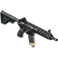 | `tacz:hk416d` | HK-416A5 突击步枪 | 步枪 | 瞄具, 枪托, 握把, 枪口, 扩容弹匣, 激光 |
| TACZ默认枪包 |  | `tacz:hk_g3` | G3 战斗步枪 | 步枪 | 瞄具, 枪托, 握把, 枪口, 扩容弹匣, 激光 |
| TACZ默认枪包 | 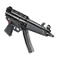 | `tacz:hk_mp5a5` | MP5A5 冲锋枪 | 冲锋枪 | 瞄具, 枪托, 握把, 枪口, 扩容弹匣, 激光 |
| TACZ默认枪包 |  | `tacz:m1014` | M1014 战斗霰弹枪 | 霰弹枪 | 枪口, 瞄具, 扩容弹匣 |
| TACZ默认枪包 |  | `tacz:m107` | M107 .50口径反器材步枪 | 狙击枪 | 瞄具, 扩容弹匣, 枪口 |
| TACZ默认枪包 | 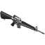 | `tacz:m16a1` | M16A1 制式步枪 | 步枪 | 枪口, 扩容弹匣, 瞄具 |
| TACZ默认枪包 | 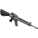 | `tacz:m16a4` | M16A4 制式步枪 | 步枪 | 枪口, 扩容弹匣, 瞄具, 握把, 枪托, 激光 |
| TACZ默认枪包 | 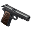 | `tacz:m1911` | M1911 手枪 | 手枪 | 枪口, 扩容弹匣 |
| TACZ默认枪包 |  | `tacz:m249` | M249 机枪 | 机枪 | 瞄具, 握把, 枪口, 扩容弹匣 |
| TACZ默认枪包 |  | `tacz:m320` | M320 榴弹发射器 | 重型武器 | 无 |
| TACZ默认枪包 | 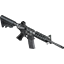 | `tacz:m4a1` | M4A1 卡宾枪 | 步枪 | 瞄具, 枪托, 激光, 握把, 枪口, 扩容弹匣 |
| TACZ默认枪包 |  | `tacz:m700` | M700 狙击步枪 | 狙击枪 | 扩容弹匣, 瞄具, 枪口 |
| TACZ默认枪包 | 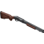 | `tacz:m870` | M870 霰弹枪 | 霰弹枪 | 扩容弹匣, 枪口 |
| TACZ默认枪包 | 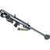 | `tacz:m95` | M95 .50口径反器材步枪 | 狙击枪 | 瞄具, 扩容弹匣, 枪口 |
| TACZ默认枪包 |  | `tacz:minigun` | M134 转管机枪 | 机枪 | 无 |
| TACZ默认枪包 | 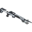 | `tacz:mk14` | MK14 EBR 精确射手步枪 | 步枪 | 瞄具, 枪托, 握把, 枪口, 扩容弹匣, 激光 |
| TACZ默认枪包 | 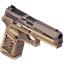 | `tacz:p320` | P320 手枪 | 手枪 | 瞄具, 枪口, 扩容弹匣, 激光 |
| TACZ默认枪包 | 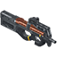 | `tacz:p90` | P90 冲锋枪 | 冲锋枪 | 瞄具, 枪口, 激光 |
| TACZ默认枪包 | 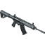 | `tacz:qbz_191` | 191式 突击步枪 | 步枪 | 枪口, 扩容弹匣, 瞄具, 握把, 激光, 枪托 |
| TACZ默认枪包 | 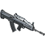 | `tacz:qbz_95` | 95式 "长弓" 突击步枪 | 步枪 | 枪口, 扩容弹匣, 瞄具, 握把, 激光 |
| TACZ默认枪包 | 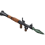 | `tacz:rpg7` | RPG-7 火箭筒 | 重型武器 | 无 |
| TACZ默认枪包 | 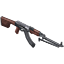 | `tacz:rpk` | RPK 轻机枪 | 机枪 | 瞄具, 枪托, 枪口, 扩容弹匣 |
| TACZ默认枪包 | 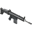 | `tacz:scar_h` | SCAR-H 战斗步枪 | 步枪 | 瞄具, 枪托, 握把, 枪口, 扩容弹匣, 激光 |
| TACZ默认枪包 | 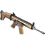 | `tacz:scar_l` | SCAR-L 突击步枪 | 步枪 | 瞄具, 枪托, 握把, 枪口, 扩容弹匣, 激光 |
| TACZ默认枪包 |  | `tacz:sks_tactical` | SKS 战术步枪 | 步枪 | 瞄具, 枪托, 握把, 枪口, 扩容弹匣 |
| TACZ默认枪包 | 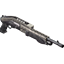 | `tacz:spas_12` | SPAS-12 多功能霰弹枪 | 霰弹枪 | 扩容弹匣, 枪托, 瞄具, 枪口 |
| TACZ默认枪包 |  | `tacz:spr15hb` | SPR-15 HB “射手座” 反狙击步枪 | 步枪 | 枪口, 扩容弹匣, 瞄具, 握把, 枪托 |
| TACZ默认枪包 |  | `tacz:springfield1873` | 春田 1873 活门步枪 | 狙击枪 | 瞄具, 扩容弹匣 |
| TACZ默认枪包 |  | `tacz:timeless50` | §6永恒 .50 Z型 | 手枪 | 瞄具, 枪口, 扩容弹匣, 激光 |
| TACZ默认枪包 | 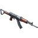 | `tacz:type_81` | 81-1式 制式步枪 | 步枪 | 枪口, 扩容弹匣 |
| TACZ默认枪包 | 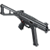 | `tacz:ump45` | UMP45 冲锋枪 | 冲锋枪 | 瞄具, 枪口, 握把, 扩容弹匣, 激光 |
| TACZ默认枪包 | 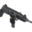 | `tacz:uzi` | 乌兹冲锋枪 | 冲锋枪 | 瞄具, 枪口, 扩容弹匣 |
| TACZ默认枪包 | 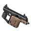 | `tacz:vector45` | 维克托 冲锋枪 | 冲锋枪 | 瞄具, 枪托, 握把, 枪口, 激光, 扩容弹匣 |
| 薰衣草枪包 |  | `lavender:at_vickers_crawford` | 维克斯-克劳福德反载具火箭炮 | 重型武器 | 瞄具, 枪口, 握把, 枪托, 扩容弹匣 |
| 薰衣草枪包 |  | `lavender:berreta1915` | 波莱塔M1915半自动手枪 | 手枪 | 无 |
| 薰衣草枪包 |  | `lavender:berretam1918` | 列维里波莱塔M1918自动装填步枪 | 冲锋枪 | 瞄具, 枪口, 握把, 枪托, 扩容弹匣 |
| 薰衣草枪包 |  | `lavender:berthier1892` | Berthier1892贝蒂埃步枪/卡宾枪 | 步枪 | 瞄具, 枪口, 扩容弹匣 |
| 薰衣草枪包 |  | `lavender:berthier1916` | BerthierMle1916贝蒂埃步枪 | 步枪 | 瞄具, 枪口, 握把 |
| 薰衣草枪包 |  | `lavender:bodeo1889` | 博代奥M1889转轮手枪 | 手枪 | 无 |
| 薰衣草枪包 |  | `lavender:browning1918` | 勃朗宁M1918自动装填步枪 | 机枪 | 瞄具, 握把, 枪口, 扩容弹匣 |
| 薰衣草枪包 |  | `lavender:bulldog` | 斗牛犬袖珍转轮手枪 | 手枪 | 无 |
| 薰衣草枪包 |  | `lavender:c93` | 博查特C93自动手枪 | 手枪 | 无 |
| 薰衣草枪包 |  | `lavender:c96` | 毛瑟C96手枪 | 手枪 | 无 |
| 薰衣草枪包 |  | `lavender:carcanom1891` | 卡尔卡诺M1891步枪 | 步枪 | 瞄具, 枪口, 握把 |
| 薰衣草枪包 |  | `lavender:carcanom1891_2` | 卡尔卡诺M1891卡宾枪 | 步枪 | 瞄具, 枪口 |
| 薰衣草枪包 |  | `lavender:cei_rigotti` | 希-瑞戈蒂Cei_Rigotti(全)/半自动装填步枪 | 步枪 | 瞄具, 枪口, 扩容弹匣, 握把 |
| 薰衣草枪包 |  | `lavender:chauchat` | 绍沙M915轻机枪(改进型) | 机枪 | 瞄具, 握把, 枪口, 扩容弹匣 |
| 薰衣草枪包 |  | `lavender:chauchat2` | 绍沙M1915轻机枪 | 机枪 | 瞄具, 握把, 枪口, 扩容弹匣 |
| 薰衣草枪包 |  | `lavender:christmas2025` | 2025圣诞节彩蛋-圣诞停战夜 | 重型武器 | 瞄具, 枪口, 握把, 枪托, 扩容弹匣 |
| 薰衣草枪包 |  | `lavender:darne1912` | 达恩Darne1912猎枪 | 霰弹枪 | 枪口, 扩容弹匣, 瞄具 |
| 薰衣草枪包 |  | `lavender:enfieldm1917` | 恩菲尔德P-14步枪 | 步枪 | 瞄具, 枪口, 握把 |
| 薰衣草枪包 |  | `lavender:enfieldm1917_2` | 恩菲尔德P-14卡宾枪 | 步枪 | 瞄具, 枪口, 握把 |
| 薰衣草枪包 |  | `lavender:enfieldm1917_3` | 恩菲尔德M1917步枪 | 步枪 | 瞄具, 枪口, 握把 |
| 薰衣草枪包 |  | `lavender:enfieldm1917_4` | 恩菲尔德M1917卡宾枪 | 步枪 | 瞄具, 枪口, 握把 |
| 薰衣草枪包 |  | `lavender:farquharhill` | 法夸尔·希尔导气步枪 | 步枪 | 瞄具, 枪口, 握把 |
| 薰衣草枪包 |  | `lavender:frommer1912` | 菲罗梅尔M1912停止手枪 | 手枪 | 无 |
| 薰衣草枪包 |  | `lavender:frommer1912_auto` | 菲罗梅尔M1912停止手枪(全自动) | 手枪 | 无 |
| 薰衣草枪包 |  | `lavender:gasser1870` | 嘉瑟尔-克罗帕切克M1870转轮手枪 | 手枪 | 无 |
| 薰衣草枪包 |  | `lavender:gasser1870_2` | 嘉瑟尔-克罗帕切克M1870/84转轮手枪 | 手枪 | 无 |
| 薰衣草枪包 |  | `lavender:gewehr98` | 格维尔毛瑟gewehr98步枪 | 步枪 | 瞄具, 枪口, 握把 |
| 薰衣草枪包 |  | `lavender:gewehr98b` | 毛瑟格韦尔98卡宾枪 | 步枪 | 扩容弹匣, 瞄具, 枪口 |
| 薰衣草枪包 |  | `lavender:gras1874` | 格拉斯1874/14步枪 | 步枪 | 瞄具, 枪口, 握把 |
| 薰衣草枪包 |  | `lavender:grisenti1910` | 格里森蒂半自动手枪 | 手枪 | 无 |
| 薰衣草枪包 |  | `lavender:hellriegel1915` | 赫尔里格尔1915水冷冲锋枪(轻机枪型) | 机枪 | 瞄具, 握把, 枪口, 扩容弹匣 |
| 薰衣草枪包 |  | `lavender:hellriegel1915_2` | 赫尔里格尔1915水冷冲锋枪 | 冲锋枪 | 瞄具, 握把, 枪口, 扩容弹匣 |
| 薰衣草枪包 |  | `lavender:hotchkiss` | 哈奇开斯m1909机枪(輕量化) | 机枪 | 瞄具, 握把, 枪口, 扩容弹匣 |
| 薰衣草枪包 |  | `lavender:howell` | 李-恩菲尔德mk3-豪威尔半自动装填型 | 步枪 | 瞄具, 枪口, 握把 |
| 薰衣草枪包 |  | `lavender:kar98k` | kar98k | 步枪 | 瞄具, 枪口 |
| 薰衣草枪包 |  | `lavender:karabiner88` | M1888/05委员会卡宾枪 | 步枪 | 瞄具, 枪口 |
| 薰衣草枪包 |  | `lavender:kropatschek` | 克罗帕斯克M1878步枪 | 步枪 | 瞄具, 枪口, 握把 |
| 薰衣草枪包 |  | `lavender:lebel` | 勒贝尔LebelM1886步枪 | 步枪 | 瞄具, 枪口, 握把 |
| 薰衣草枪包 |  | `lavender:lebel1893` | 勒贝尔LebelM1886/93(卡宾) | 步枪 | 瞄具, 枪口 |
| 薰衣草枪包 |  | `lavender:lebel_vb` | 维文-贝希耶尔(VB)枪榴弹发射器 | 重型武器 | 瞄具 |
| 薰衣草枪包 |  | `lavender:lee_metford` | 李-梅特福步枪 | 步枪 | 瞄具, 枪口, 握把 |
| 薰衣草枪包 |  | `lavender:lewis` | 刘易斯式轻机枪 | 机枪 | 瞄具, 握把, 枪口, 扩容弹匣 |
| 薰衣草枪包 |  | `lavender:m1879` | M1879帝国转轮手枪 | 手枪 | 无 |
| 薰衣草枪包 |  | `lavender:m1883` | M1883转轮手枪 | 手枪 | 无 |
| 薰衣草枪包 |  | `lavender:m1883_2` | M1883转轮手枪(加长) | 手枪 | 无 |
| 薰衣草枪包 |  | `lavender:m1888` | M1888/05委员会步枪 | 步枪 | 瞄具, 枪口, 握把 |
| 薰衣草枪包 |  | `lavender:m1914ruby` | M1914Ruby红宝石手枪 | 手枪 | 无 |
| 薰衣草枪包 |  | `lavender:m1917carbin` | 毛瑟C96卡宾枪 | 手枪 | 无 |
| 薰衣草枪包 |  | `lavender:m1918` | 毛瑟M1918反坦克步枪 | 步枪 | 瞄具, 扩容弹匣 |
| 薰衣草枪包 |  | `lavender:mannlicher_schonauer` | 曼利夏-舍瑙尔Y1903/14步枪 | 步枪 | 瞄具, 枪口, 握把 |
| 薰衣草枪包 |  | `lavender:mannlicher_schonauer_2` | 曼利夏-舍瑙尔Y1903/14卡宾枪 | 步枪 | 瞄具, 枪口, 握把 |
| 薰衣草枪包 |  | `lavender:mannlicherm1888` | 斯太尔-曼利彻M1888/90步枪 | 步枪 | 瞄具, 枪口, 握把 |
| 薰衣草枪包 |  | `lavender:mars` | 韦伯利—马鲁斯半自动手枪 | 手枪 | 无 |
| 薰衣草枪包 |  | `lavender:martini` | 马提尼-亨利杠杆步枪 | 步枪 | 瞄具, 枪口, 握把 |
| 薰衣草枪包 |  | `lavender:martinm1905` | 伯纳德-马丁M1905型手枪 | 手枪 | 无 |
| 薰衣草枪包 |  | `lavender:mas1873` | 圣埃蒂安'夏梅洛-德尔维涅'Mas1873右轮手枪 | 手枪 | 无 |
| 薰衣草枪包 |  | `lavender:mas1892` | 圣埃蒂安Mas1892右轮手枪 | 手枪 | 无 |
| 薰衣草枪包 |  | `lavender:mas1892c` | 圣埃蒂安Mas1892右轮手枪(加長) | 手枪 | 无 |
| 薰衣草枪包 |  | `lavender:mauser1914` | 毛瑟1914手枪 | 手枪 | 无 |
| 薰衣草枪包 |  | `lavender:mauserselbstladerm1916` | selbstlader毛瑟m1916半自动装填步枪 | 步枪 | 枪口, 瞄具, 握把 |
| 薰衣草枪包 |  | `lavender:meunier1910` | Meunier梅尼耶尔1910A6半自动装填步枪 | 步枪 | 瞄具, 枪口, 扩容弹匣, 握把 |
| 薰衣草枪包 |  | `lavender:mg0815` | 伯格曼MG08/15重型机枪 | 机枪 | 瞄具, 握把, 枪口, 扩容弹匣 |
| 薰衣草枪包 |  | `lavender:mg1417` | 伯格曼MG14/17轻型机枪 | 机枪 | 瞄具, 握把, 枪口, 扩容弹匣 |
| 薰衣草枪包 |  | `lavender:mg15na` | 伯格曼MG15N.a轻机枪 | 机枪 | 瞄具, 握把, 枪口, 扩容弹匣 |
| 薰衣草枪包 |  | `lavender:mosin1891` | 莫辛-纳甘M1891步枪 | 步枪 | 瞄具, 枪口, 握把 |
| 薰衣草枪包 |  | `lavender:mosin1907` | 莫辛-纳甘M1907卡宾枪 | 步枪 | 瞄具, 枪口, 握把 |
| 薰衣草枪包 |  | `lavender:mosin_dra` | 莫辛-纳甘骑枪(龙骑兵型) | 步枪 | 瞄具, 枪口, 握把 |
| 薰衣草枪包 |  | `lavender:mp18` | 伯格曼Mp18冲锋枪 | 冲锋枪 | 瞄具, 枪口, 握把, 枪托, 扩容弹匣 |
| 薰衣草枪包 |  | `lavender:nagant1895` | 纳甘M1895转轮手枪 | 手枪 | 无 |
| 薰衣草枪包 |  | `lavender:obrez` | Obrez莫辛纳甘截短手枪 | 手枪 | 瞄具, 枪口 |
| 薰衣草枪包 |  | `lavender:ovp_smg` | ovp自动装填冲锋枪 | 冲锋枪 | 瞄具, 枪口, 握把, 枪托, 扩容弹匣 |
| 薰衣草枪包 |  | `lavender:p08` | 鲁格P08手枪 | 手枪 | 无 |
| 薰衣草枪包 |  | `lavender:p082` | 鲁格P08載具卡賓槍 | 手枪 | 瞄具, 枪口, 扩容弹匣 |
| 薰衣草枪包 |  | `lavender:perino1908` | 佩里诺m1908重机枪(轻量化) | 机枪 | 瞄具, 握把, 枪口, 扩容弹匣 |
| 薰衣草枪包 |  | `lavender:ribeyrolles1918` | 利贝罗勒M1918自动装填步枪 | 冲锋枪 | 瞄具, 枪口, 握把, 枪托, 扩容弹匣 |
| 薰衣草枪包 |  | `lavender:rsc` | RSC1917半自动装填步枪 | 步枪 | 瞄具, 枪口, 握把 |
| 薰衣草枪包 |  | `lavender:rsc2` | RSC冲锋枪 | 冲锋枪 | 瞄具, 枪口, 握把, 枪托, 扩容弹匣 |
| 薰衣草枪包 |  | `lavender:schilt` | 希尔特No.3bis火焰喷射器(轻量化) | 重型武器 | 无 |
| 薰衣草枪包 |  | `lavender:selbstladerc98` | Mauser毛瑟C98半自动步枪 | 步枪 | 瞄具, 枪口, 扩容弹匣, 握把 |
| 薰衣草枪包 |  | `lavender:selbstladerm1906` | selbstlader鲁格m1906半自动装填步枪 | 步枪 | 瞄具, 枪口, 扩容弹匣, 握把 |
| 薰衣草枪包 |  | `lavender:signal_gun` | 信号枪 | 重型武器 | 瞄具, 枪口, 握把, 枪托, 扩容弹匣 |
| 薰衣草枪包 |  | `lavender:smle_iii` | Smle_MkIII/Lee.Enfield李.恩菲尔德步枪 | 步枪 | 瞄具, 枪口, 握把 |
| 薰衣草枪包 |  | `lavender:smle_iii_2` | Smle_MkIII/Lee.Enfield李.恩菲尔德卡宾枪 | 步枪 | 瞄具, 枪口 |
| 薰衣草枪包 |  | `lavender:star` | 超级明星-半自动手枪 | 手枪 | 无 |
| 薰衣草枪包 |  | `lavender:steyr1901` | 罗斯-斯太尔M1901半自动手枪 | 手枪 | 无 |
| 薰衣草枪包 |  | `lavender:steyr1907` | 罗斯-斯太尔M1907半自动手枪 | 手枪 | 无 |
| 薰衣草枪包 |  | `lavender:steyr1912` | 罗斯-斯太尔M1912半自动手枪 | 手枪 | 无 |
| 薰衣草枪包 |  | `lavender:steyr1912_trench` | 罗斯-斯太尔M1912半自动手枪(战壕) | 手枪 | 无 |
| 薰衣草枪包 |  | `lavender:steyrmannlicherm1895` | 斯太尔-曼利彻M1895式步枪 | 步枪 | 瞄具, 枪口, 握把 |
| 薰衣草枪包 |  | `lavender:steyrmannlicherm1895_2` | 斯太尔-曼利彻M1895卡宾枪 | 步枪 | 瞄具, 枪口, 握把 |
| 薰衣草枪包 |  | `lavender:steyrmannlicherm1905` | 斯太尔-曼利彻M1905式实验性半自动步枪 | 步枪 | 瞄具, 枪口, 握把 |
| 薰衣草枪包 |  | `lavender:sturmpistole1918` | sturmpistole1918(轻量化) | 冲锋枪 | 瞄具, 枪口, 握把, 枪托, 扩容弹匣 |
| 薰衣草枪包 |  | `lavender:vetterli1870` | 维特利M1870/87步枪 | 步枪 | 瞄具, 枪口, 握把 |
| 薰衣草枪包 |  | `lavender:vetterli1887` | 维特利M1870/87/15卡宾枪 | 步枪 | 瞄具, 枪口, 握把 |
| 薰衣草枪包 |  | `lavender:viller_perosa` | 维勒佩洛萨M1915轻机枪(冲锋枪) | 机枪 | 瞄具, 枪口, 握把, 枪托, 扩容弹匣 |
| 薰衣草枪包 |  | `lavender:webleymk1` | 韦伯利斯科特MK I 自动手枪 | 手枪 | 无 |
| 薰衣草枪包 |  | `lavender:webleymk6` | 韦伯利MK VI 转轮手枪 | 手枪 | 无 |
| 薰衣草枪包 |  | `lavender:wex` | WEX火焰喷射器 | 重型武器 | 无 |
| 薰衣草枪包 |  | `lavender:whistle` | 战壕哨(催命哨) | 重型武器 | 瞄具 |
| 薰衣草枪包 |  | `lavender:winchester1895` | 温彻斯特M1895杠杆步枪 | 步枪 | 瞄具, 枪口, 握把 |
| 启示录枪包 |  | `bf1:chauchat` | 绍沙 轻机枪 | 机枪 | 握把, 瞄具, 枪托, 扩容弹匣 |
| 启示录枪包 |  | `bf1:de_lisle` | 德利尔 微声卡宾枪 | 步枪 | 扩容弹匣, 瞄具 |
| 启示录枪包 |  | `bf1:ef46` | 46型冲锋火焰喷射器 | 霰弹枪 | 无 |
| 启示录枪包 |  | `bf1:f_faust` | 刺拳防空火箭筒B型 | 重型武器 | 无 |
| 启示录枪包 |  | `bf1:handgun` | “手”枪 | 手枪 | 枪口 |
| 启示录枪包 |  | `bf1:kolibri` | 蜂鸟 手枪 | 手枪 | 扩容弹匣 |
| 启示录枪包 |  | `bf1:lewis` | 刘易斯 轻机枪 | 机枪 | 瞄具, 枪托, 扩容弹匣 |
| 启示录枪包 |  | `bf1:liu` | 刘将军步枪 | 步枪 | 瞄具, 握把, 枪口 |
| 启示录枪包 |  | `bf1:lunge_mine` | 四式反坦克刺雷 | 重型武器 | 无 |
| 启示录枪包 |  | `bf1:m1916` | M1916 自动装填步枪 | 步枪 | 瞄具, 握把, 枪口 |
| 启示录枪包 |  | `bf1:m2_2` | M2 火焰喷射器 | 霰弹枪 | 无 |
| 启示录枪包 |  | `bf1:man_m95` | 曼利夏 M1895 步枪 | 狙击枪 | 瞄具, 枪口 |
| 启示录枪包 |  | `bf1:martini` | 马提尼-亨利 步枪 | 狙击枪 | 瞄具, 握把, 枪口 |
| 启示录枪包 |  | `bf1:mg0815` | MG08/15 机枪 | 机枪 | 握把, 瞄具, 枪托, 枪口, 扩容弹匣 |
| 启示录枪包 |  | `bf1:mg42` | MG42 通用机枪 | 机枪 | 瞄具, 握把, 扩容弹匣 |
| 启示录枪包 |  | `bf1:mhgl` | 马提尼-亨利 步枪榴弹发射器 | 重型武器 | 瞄具 |
| 启示录枪包 |  | `bf1:model10` | Model 10-A 霰弹枪 | 霰弹枪 | 扩容弹匣, 瞄具, 枪托, 枪口, 握把 |
| 启示录枪包 |  | `bf1:obrez` | 莫辛-纳甘截短手枪 | 手枪 | 瞄具, 枪口, 扩容弹匣, 激光 |
| 启示录枪包 |  | `bf1:rorsch_mk4` | 罗氏 Mk-4 轨道炮 | 狙击枪 | 瞄具, 激光, 扩容弹匣 |
| 启示录枪包 |  | `bf1:rsc1917` | RSC 1917 半自动步枪 | 步枪 | 瞄具, 握把, 枪口 |
| 启示录枪包 |  | `bf1:sjogren` | 舍格伦 惯性霰弹枪 | 霰弹枪 | 扩容弹匣, 枪口 |
| 启示录枪包 |  | `bf1:smg0818` | SMG08/18 冲锋枪 | 冲锋枪 | 瞄具, 握把, 枪口 |
| 启示录枪包 |  | `bf1:sw_model3` | 3号左轮手枪 | 手枪 | 枪托, 扩容弹匣 |
| 启示录枪包 |  | `bf1:syringe` | 医疗用针筒 | 手枪 | 无 |
| 启示录枪包 |  | `bf1:tg1918` | M1918 反坦克步枪 | 狙击枪 | 瞄具, 握把, 枪口, 扩容弹匣 |
| 启示录枪包 |  | `bf1:vg15` | VG1-5 人民突击步枪 | 步枪 | 瞄具, 枪托, 枪口, 握把, 扩容弹匣 |
| 启示录枪包 |  | `bf1:vp1915` | 维拉·佩罗萨 冲锋枪 | 冲锋枪 | 瞄具, 枪托, 握把, 枪口, 扩容弹匣 |
| 启示录枪包 |  | `bf1:welrod` | 威尔洛德 微声手枪 | 手枪 | 瞄具 |
| 启示录枪包 |  | `bf1:wex` | Wex 火焰喷射器 | 霰弹枪 | 无 |
| 启示录枪包 |  | `bf1:zk383` | ZK-383 冲锋枪 | 冲锋枪 | 瞄具, 枪口, 握把, 扩容弹匣 |

---

### 配件槽位说明

| 槽位类型 | 说明 | 可安装的配件类别 |
|---|---|---|
| scope | 瞄具 | 红点、全息、倍镜、光学瞄具等 |
| muzzle | 枪口 | 消音器、制退器、补偿器、刺刀等 |
| stock | 枪托 | 各类枪托、肩托等 |
| grip | 握把 | 前握把、角握把、bipod脚架等 |
| laser | 激光 | 激光指示器 |
| extended_mag | 扩容弹匣 | 各类扩容弹匣/供弹具 |

> 图片资源来自各枪包中的 slot/HUD 纹理，位于 `./images/` 目录下。
> 如某些条目没有图片，表示该枪包未提供对应的图标纹理。
